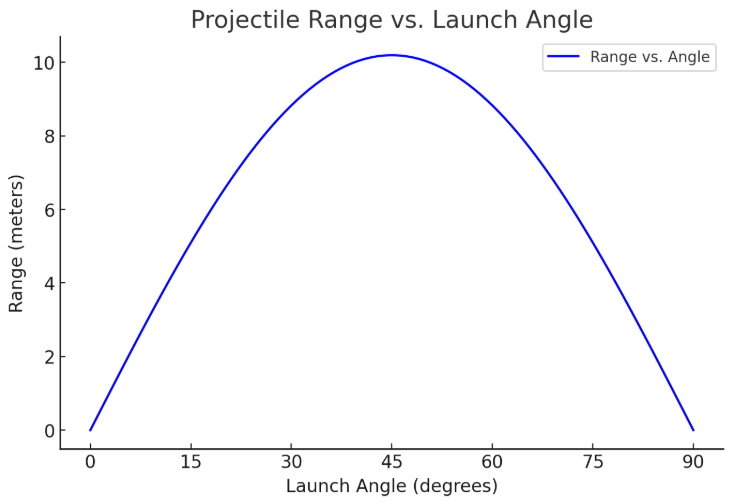
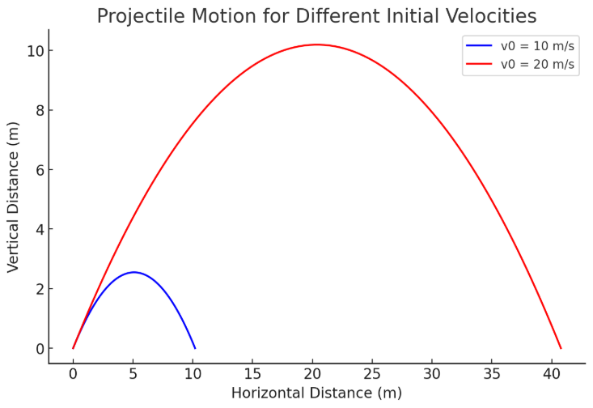
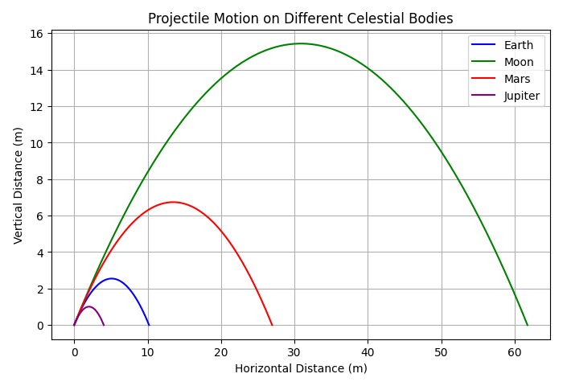
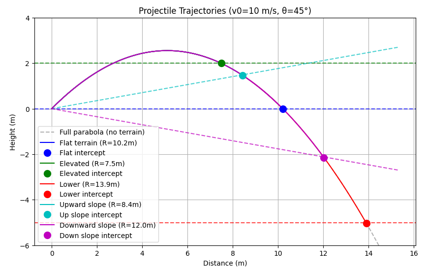

# Problem 1

# Investigating the Range as a Function of the Angle of Projection
## Introduction
Projectile motion, while seemingly simple, offers a rich playground for exploring fundamental principles of physics. This report investigates how the range of a projectile depends on its angle of projection.

## Theoretical Foundation
In the foundation of projectile movement lie the Laws of Newton:

### First Law
An object at rest will stay at rest, and an object in motion will continue moving with constant velocity unless acted upon by a net external force. In terms of projectile motion, this means that once an object is in motion (like a ball thrown in the air), it will keep moving at a constant velocity in a straight line unless a force (like gravity or air resistance) acts on it.

### Second Law
This law states that the acceleration of an object is directly proportional to the net force acting on it and inversely proportional to its mass: 

$F=ma$ 

Where:

* F is the net force 
* m is the mass of the object
* a is the acceleration

In projectile motion, gravity provides a constant downward force that accelerates the object downward at a rate of approximately 
$9.8 \frac{m}{s^2}$ (on Earth).

### Third Law

This law states that for every action, there is an equal and opposite reaction. In projectile motion, this law isn't as directly involved in the motion of the object but can be observed in other interactions.

### Motion Components
A projectile moves under the influence of gravity, meaning its horizontal and vertical motions are independent except for the time variable. The acceleration due to gravity acts only in the vertical direction, making the motion two-dimensional.

**Horizontal Motion**: The object moves horizontally with a constant velocity (since there is no force acting horizontally, assuming no air resistance).

**Vertical Motion**: The object moves vertically with constant acceleration due to gravity, starting with an initial velocity in the upward direction (if thrown upward) or zero velocity (if dropped).

### Main formulas:

* $x(t) = v_0\cos(θ)t$ - horizontal displacement

This equation comes from the definition of constant velocity motion:

The horizontal component of velocity is \( v_0 \cos(\theta) \) (initial velocity times the cosine of the launch angle).

There is no acceleration in the x-direction (ignoring air resistance), so distance is simply velocity times time.

* $y(t) = v_0\sin(θ)t-\frac{1}{2}gt^2$ - vertical displacement

This equation follows from the kinematic equation for motion under constant acceleration:

$$
y = v_0 t + \frac{1}{2} a t^2
$$

Since gravity acts downward with acceleration \( g \), we replace \( a \) with \( -g \), leading to the negative term.

From the two formulas a single formula for the distance can be derived:

###### 1. Determine the Total Time of Flight

The vertical displacement equation for projectile motion is:  
   $$
   y(t) = v_0 \sin(\theta) t - \frac{1}{2} g t^2
   $$
Since the projectile returns to the ground, we set \( y = 0 \) and solve for \( t \):  
   $$
   0 = v_0 \sin(\theta) t - \frac{1}{2} g t^2
   $$  
Factor out \( t \):  
   $$
   t \left( v_0 \sin(\theta) - \frac{1}{2} g t \right) = 0
   $$  
This gives two solutions:  
   $$
   t = 0  \quad \text{(initial time)}
   $$  
   $$
   t = \frac{2 v_0 \sin(\theta)}{g}
   $$  
Thus, the **total time of flight** is:  
   $$
   T = \frac{2 v_0 \sin(\theta)}{g}
   $$

###### 2. Use the Horizontal Displacement Formula

The horizontal displacement is given by:  
   $$
   x = v_0 \cos(\theta) t
   $$  
Since range \( R \) is the total horizontal distance when the projectile lands, we substitute \( t = T \):

   $$
   R = v_0 \cos(\theta) \cdot \frac{2 v_0 \sin(\theta)}{g}
   $$

###### 3. Simplify Using Trigonometric Identity

Using the identity \( \sin(2\theta) = 2 \sin(\theta) \cos(\theta) \), we get:

   $$
   R = \frac{v_0^2 \sin(2\theta)}{g}
   $$

###### Conclusion

Thus, the **range formula** for projectile motion is:  
   $$
   R = \frac{v_0^2 \sin(2\theta)}{g}
   $$

## Analyzing the Range with Regard to Angle

The range is **directly proportional** to \( \sin 2\theta \), meaning that if \( \sin 2\theta \) increases, the range also increases, and if \( \sin 2\theta \) decreases, the range decreases accordingly.

To analyze how the range varies with \( \theta \), we observe that:

- The function \( \sin 2\theta \) reaches its maximum value of **1** when \( 2\theta = 90^\circ \), or equivalently, \( \theta = 45^\circ \). This means the projectile achieves its maximum range at \( 45^\circ \).

- Since the sine function is symmetric about \( 90^\circ \), the range is the same for angles that sum to \( 90^\circ \) (e.g., \( 30^\circ \) and \( 60^\circ \) yield the same range).

- For small or large angles near \( 0^\circ \) and \( 90^\circ \), \( \sin 2\theta \) approaches zero, causing the range to decrease.

The following graph illustrates the relationship between \( R \) and \( \theta \), showing how the range increases up to \( 45^\circ \) and then decreases symmetrically. The velocity was chosen 

However, angle is not a single parameter that determines the range - there is also velocity and gravitational acceleration:

- Velocity is proportional to the range, as it stands in the numerator of the equation. The higher the velocity - the higher the distance that the object is able to travel.

For example, let's compare the initial velocity of the thrown object of 10 m/s and 20 m/s by putting them into the formula and plotting their trajectories. We will use the same angle for both instances of 45°.

$10 m/s$

$$
R = \frac{10^2 \sin(2*45°)}{g} = 10m
$$

$20 m/s$

$$
R = \frac{20^2 \sin(2*45°)}{g} = 40 m
$$

- Gravitational acceleration is antiproportional to the range, as it stands in the denomenator of the equation. The higher the gravitational acceleration - the faster the object is gonna fall, and hence, the less distance it will be able to travel.

To visualise that, we can again try to plot different trajectories, but this time changing only the gravitational acceleration. The velocity and the angle are going to remain the same: 10 m/s and 45° respectively:

The picture depicts the trajectory the object would have if it was thrown on the surface of different celestial bodies, namely:

- Earth

- Moon

- Mars

- Jupiter

As Jupiter is the most massive among these bodies, its gravitational force is also the largest which means that the range is the smallest, while the moon is the lightest among these bodies, and the range is respectively the biggest.

## Practical applications

Projectile motion lies at the foundation of mechanics and has countless applications in real life. It can be seen in something as simple as children throwing snowballs in winter or as complex as launching a missile to another country. However, real-life applications are more complex than a simple formula. We must account for air resistance, uneven terrain, and other forces that could affect the flight.

For example, air resistance slows down the object by absorbing some of its energy. Additionally, an object may land higher or lower than its initial position depending on the terrain, which would influence its flight range.

A model of the influence of the terrain:

## Implementation

The following representation allows to built your own trajectory based on the entered parameters.
Try tweaking the velocity, angle, and gravity to see how the trajectory changes:

    <iframe src="https://ophysics.com/k8.html" style="width: 1100px; height: 762px; transform: scale(0.7); transform-origin: top left; border: 0;" scrolling="no"></iframe>

## Conclusion

In this report, we investigated projectile motion, explored its theoretical foundation, analyzed the function's range, discussed practical applications, and implemented its trajectory using Python code.