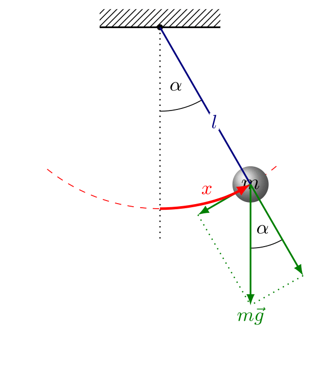

# Problem 2

# Investigating the Dynamics of a Forced Damped Pendulum

## Introduction

### Background & Motivation

A forced damped pendulum is a type of pendulum that experiences both friction (damping) and an external force that pushes it at regular intervals. Unlike a simple pendulum that just swings back and forth, this system can show a wide range of behaviors, from smooth and predictable motion to completely chaotic swings. This makes it an interesting and important topic in physics.

Studying this system helps us understand real-world situations where similar dynamics appear. For example, bridges and buildings that experience repeated forces from wind or earthquakes, electrical circuits with alternating currents, and even climate models where periodic forces influence weather patterns all share similarities with the forced damped pendulum. By learning how this system behaves, we can gain insights into many different areas of science and engineering.

### Objective of the Report

This report will explore the forced damped pendulum from different angles:

- Theoretical Foundation: We'll look at the main equation that describes its motion and see how it behaves under different conditions.

- Analysis of Dynamics: We'll explore how changing factors like friction, the strength of the external force, and its frequency affect the pendulum's motion, including how it can become chaotic.

- Practical Applications: We'll discuss real-world systems that work similarly, such as energy harvesting devices and vibration control systems.

- Computational Implementation: We'll create a computer simulation to visualize how the pendulum moves under different conditions and analyze its behavior using tools like phase diagrams and Poincaré sections.

By the end of this report, we should have a clearer understanding of how the forced damped pendulum works and why it is relevant to various fields of science and engineering.

## Theoretical Foundation

###Simple Pendulum

To understand forced damping pendulum, let's start with a simple pendulum to build up on that, gradually understanding phenomena of "damping" and "forcing"

A simple pendulum is a mass (called the bob) attached to a string or rod that swings back and forth under the influence of gravity. The key features of a simple pendulum are:

- The bob is usually a small, dense object like a metal ball.

- The string or rod is ideally massless and inextensible (it doesn’t stretch).

- The pendulum moves in a plane and oscillates around a fixed point.

When displaced from its equilibrium position and released, the pendulum swings back and forth in a periodic motion.

#### How does it work?

The motion of a simple pendulum can be broken down using physics concepts like circular motion and gravitation.

The forces on the pendulum bob are:

- **Gravity**: Acts downward with magnitude \( mg \).

- **Tension (T)**: Acts along the string, providing a radial force.

$$$$

1. Gravity can be decomposed into:

    - **Radial component**: \( mg \cos\theta \) - Points toward the pivot and is balanced by the tension in the string.

    - **Tangential component**: \( mg \sin\theta \) (causes oscillation) - Acts along the direction of motion and is responsible for the pendulum's oscillation.

2. Circular Motion Equations:

Since the pendulum moves along a circular arc of radius \( L \) (length of string), the radial and tangential forces obey:

**Radial force equation:**
$$
T - mg \cos\theta = m \frac{v^2}{L}
$$

**Tangential force equation (Newton's Second Law in tangential direction):**
$$
 m \frac{d^2s}{dt^2} = -mg \sin\theta
$$
Since arc length \( s \) is related to angular displacement \( \theta \) by \( s = L\theta \), this simplifies to:
$$
\frac{d^2\theta}{dt^2} + \frac{g}{L} \sin\theta = 0
$$
