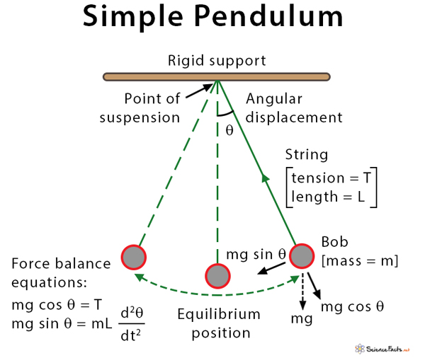

# Problem 2

# Investigating the Dynamics of a Forced Damped Pendulum

## Introduction

### Background & Motivation

A forced damped pendulum is a type of pendulum that experiences both friction (damping) and an external force that pushes it at regular intervals. Unlike a simple pendulum that just swings back and forth, this system can show a wide range of behaviors, from smooth and predictable motion to completely chaotic swings. This makes it an interesting and important topic in physics.

Studying this system helps us understand real-world situations where similar dynamics appear. For example, bridges and buildings that experience repeated forces from wind or earthquakes, electrical circuits with alternating currents, and even climate models where periodic forces influence weather patterns all share similarities with the forced damped pendulum. By learning how this system behaves, we can gain insights into many different areas of science and engineering.

### Objective of the Report

This report will explore the forced damped pendulum from different angles:

- Theoretical Foundation: We'll look at the main equation that describes its motion and see how it behaves under different conditions.

- Analysis of Dynamics: We'll explore how changing factors like friction, the strength of the external force, and its frequency affect the pendulum's motion, including how it can become chaotic.

- Practical Applications: We'll discuss real-world systems that work similarly, such as energy harvesting devices and vibration control systems.

- Computational Implementation: We'll create a computer simulation to visualize how the pendulum moves under different conditions and analyze its behavior using tools like phase diagrams and Poincaré sections.

By the end of this report, we should have a clearer understanding of how the forced damped pendulum works and why it is relevant to various fields of science and engineering.

## Theoretical Foundation

### Simple Pendulum

To understand forced damping pendulum, let's start with a simple pendulum to build up on that, gradually understanding phenomena of "damping" and "forcing"

A simple pendulum is a mass (called the bob) attached to a string or rod that swings back and forth under the influence of gravity. The key features of a simple pendulum are:

- The bob is usually a small, dense object like a metal ball.

- The string or rod is ideally massless and inextensible (it doesn’t stretch).

- The pendulum moves in a plane and oscillates around a fixed point.

When displaced from its equilibrium position and released, the pendulum swings back and forth in a periodic motion.

#### How does it work?

The motion of a simple pendulum can be broken down using physics concepts like circular motion and gravitation.

The forces on the pendulum bob are:

- **Gravity**: Acts downward with magnitude \( mg \).

- **Tension (T)**: Acts along the string, providing a radial force.

$$$$

1. Gravity can be decomposed into:

    - **Radial component**: \( mg \cos\theta \) - Points toward the pivot and is balanced by the tension in the string.

    - **Tangential component**: \( mg \sin\theta \) (causes oscillation) - Acts along the direction of motion and is responsible for the pendulum's oscillation.

2. Circular Motion Equations:

Since the pendulum moves along a circular arc of radius \( L \) (length of string), the radial and tangential forces obey:

**Radial force equation:**
$$
T - mg \cos\theta = m \frac{v^2}{L}
$$

**Tangential force equation (Newton's Second Law in tangential direction):**

**Tangential Force**: 
   $$
   m \frac{d^2s}{dt^2} = -mg \sin\theta
   $$
   where:

- \( m \) is the mass,

- \( \frac{d^2s}{dt^2} \) is tangential acceleration,

- \( -mg \sin\theta \) is the tangential component of gravitational force.

**Arc Length Relation**: Since \( s = L\theta \) (where \( L \) is the length and \( \theta \) is the angular displacement), we differentiate to find:
   $$
   \frac{d^2s}{dt^2} = L \frac{d^2\theta}{dt^2}
   $$

**Simplified Equation**: Substituting this into the original equation:
   $$
   L \frac{d^2\theta}{dt^2} = -g \sin\theta
   $$
   Simplifying further:
   $$
   \frac{d^2\theta}{dt^2} + \frac{g}{L} \sin\theta = 0
   $$

This is the equation governing the angular motion of a pendulum. It describes the angular acceleration \( \frac{d^2\theta}{dt^2} \) as a function of the angle \( \theta \).

---

### Damping in a Pendulum

#### Introduction

In an idealized simple pendulum, motion continues indefinitely without any loss of energy. However, in real-world scenarios, a pendulum experiences resistance forces such as air drag and friction at the pivot, leading to energy dissipation over time. This phenomenon is known as **damping**.

---

#### The Damping Coefficient \( b \)

The damping coefficient \( b \) characterizes the strength of resistance in the system and appears in the damping force:

\[
F_{\text{damping}} = -b \cdot \frac{ds}{dt}
\]

- It is proportional to the velocity and always opposes motion.
- It depends on physical factors such as air viscosity, size of the bob, and pivot friction.

**Units**:
$$
[b] = \frac{\text{N}}{\text{m/s}} = \text{kg/s}
$$

**In Practice**, \( b \) can originate from:

- **Air Resistance**: Modeled (at low speeds) by Stokes' Law as \( b = 6\pi \eta r \), where \( \eta \) is the fluid viscosity and \( r \) is the radius of the bob.
- **Pivot Friction**: Often too complex to model analytically; usually estimated experimentally.
- **Empirical Estimation**: You can fit real-world data (decay of amplitude) to extract \( b \) using a damped oscillation model.

---

#### The Damped Pendulum Equation

To account for damping, an additional term is introduced in Newton’s Second Law, representing a resistive force proportional to velocity:

\[
m \frac{d^2s}{dt^2} + b \frac{ds}{dt} + mg \sin\theta = 0
\]

where:

- \( m \) is the mass of the pendulum bob,

- \( s \) is the arc length (or \( \theta \) for angular motion),

- \( b \) is the damping coefficient (determining the strength of resistance),

- \( g \) is the acceleration due to gravity.

In terms of angular displacement \( \theta \), using \( s = L\theta \):

\[
\frac{d^2\theta}{dt^2} + \frac{b}{m} \frac{d\theta}{dt} + \frac{g}{L} \sin\theta = 0
\]

---

#### Types of Damping in a Pendulum

In a damped pendulum, the equation of motion with angular displacement \( \theta \) is:

$$ \theta'' + \frac{b}{m} \theta' + \frac{g}{L} \sin(\theta) = 0 $$

For small angles (\( \sin(\theta) \approx \theta \)), it simplifies to a linear form:

$$ \theta'' + \frac{b}{m} \theta' + \frac{g}{L} \theta = 0 $$

This is a second-order linear differential equation, where:

- \( \theta'' \): Angular acceleration (rad/s²),

- \( \frac{b}{m} \theta' \): Damping term, with \( b \) as the damping coefficient (kg/s) and \( m \) as mass (kg),

- \( \frac{g}{L} \theta \): Restoring term, with \( g \) as gravity (9.8 m/s²) and \( L \) as pendulum length (m).

Define:

- \( \gamma = \frac{b}{2m} \): Damping factor (s⁻¹),

- \( \omega_0 = \sqrt{\frac{g}{L}} \): Natural angular frequency (rad/s).

The characteristic equation is:

$$ r^2 + \frac{b}{m} r + \frac{g}{L} = 0 $$

Or:

$$ r^2 + 2\gamma r + \omega_0^2 = 0 $$

The discriminant determines the damping type:

$$ \Delta = \left(\frac{b}{m}\right)^2 - 4 \frac{g}{L} = 4\gamma^2 - 4\omega_0^2 $$

The three types of damping are:

##### 1. Underdamped
- **Condition**: \( \Delta < 0 \) or \( \gamma < \omega_0 \) (i.e., \( \frac{b}{2m} < \sqrt{\frac{g}{L}} \)).
- **Description**: Oscillates with decreasing amplitude.
- **Roots**: Complex, \( r = -\gamma \pm i\sqrt{\omega_0^2 - \gamma^2} \).
- **Solution**:
  $$ \theta(t) = e^{-\gamma t} [A \cos(\omega t) + B \sin(\omega t)] $$
  Or:
  $$ \theta(t) = C e^{-\gamma t} \cos(\omega t + \phi) $$
  - \( \omega = \sqrt{\omega_0^2 - \gamma^2} \): Damped frequency,
  - \( A, B \) or \( C, \phi \): Constants from initial conditions.
- **Behavior**: Pendulum swings, amplitude shrinks exponentially.

##### 2. Critically Damped
- **Condition**: \( \Delta = 0 \) or \( \gamma = \omega_0 \) (i.e., \( \frac{b}{2m} = \sqrt{\frac{g}{L}} \)).
- **Description**: Returns to equilibrium fastest without oscillating.
- **Roots**: Real, equal, \( r = -\gamma = -\sqrt{\frac{g}{L}} \).
- **Solution**:
  $$ \theta(t) = (A + B t) e^{-\gamma t} $$
  - \( A, B \): Constants from initial conditions.
- **Behavior**: Smooth return to vertical, no overshoot.

##### 3. Overdamped
- **Condition**: \( \Delta > 0 \) or \( \gamma > \omega_0 \) (i.e., \( \frac{b}{2m} > \sqrt{\frac{g}{L}} \)).
- **Description**: Returns to equilibrium slowly, no oscillations.
- **Roots**: Real, distinct, \( r_{1,2} = -\gamma \pm \sqrt{\gamma^2 - \omega_0^2} \).
- **Solution**:
  $$ \theta(t) = A e^{r_1 t} + B e^{r_2 t} $$
  - \( r_1, r_2 < 0 \): Both terms decay.
- **Behavior**: Slow, non-oscillatory return.

#### Physical Insight
- **Underdamped**: Light damping, oscillations persist (e.g., pendulum in air).
- **Critically Damped**: Balanced damping, fastest non-oscillatory return (e.g., tuned suspension).
- **Overdamped**: Heavy damping, sluggish return (e.g., pendulum in oil).

##### Damping Ratio
Define \( \zeta = \frac{\gamma}{\omega_0} = \frac{b}{2m \sqrt{\frac{g}{L}}} \):
- \( \zeta < 1 \): Underdamped,
- \( \zeta = 1 \): Critically damped,
- \( \zeta > 1 \): Overdamped.

##### Notes
The linear form applies for small angles. For large \( \theta \), the nonlinear \( \sin(\theta) \) term complicates behavior, but these types still guide qualitative outcomes.

---

#### Real-World Examples of Damping

- **Grandfather clocks**: Experience mild underdamping due to air and pivot friction.
- **Car shock absorbers**: Use critical damping for quick stabilization.
- **Seismic dampers in buildings**: Use overdamping to absorb energy and prevent dangerous swaying.

---

#### Conclusion

Damping is an essential feature of real pendulum motion. While an ideal pendulum would swing forever, damping gradually removes energy from the system. Understanding the role and magnitude of the damping coefficient \( b \) is crucial for accurately modeling the behavior of any real oscillatory system.

---

### Forcing in a Pendulum

#### Introduction

In the real world, many systems are not only subject to internal resistive forces (damping) but also influenced by external periodic forces. A **forced pendulum** is one where an external agent continuously applies a time-varying force, typically periodic, such as a push at regular intervals. This makes the pendulum a **non-conservative, driven oscillator**.

#### External Forcing Term

An external force is often modeled as sinusoidal:

\[
F_{\text{ext}}(t) = F_0 \cos(\omega t)
\]

- \( F_0 \): Amplitude of the forcing (N),
- \( \omega \): Angular frequency of the driving force (rad/s),
- \( t \): Time (s).

This force adds energy to the system and competes with damping to influence long-term behavior.

---

#### The Forced Damped Pendulum Equation

Including the forcing term, the angular equation of motion becomes:

\[
\frac{d^2\theta}{dt^2} + \frac{b}{m} \frac{d\theta}{dt} + \frac{g}{L} \sin\theta = \frac{F_0}{mL} \cos(\omega t)
\]

This is a **nonlinear second-order differential equation**, combining restoring force, damping, and external periodic driving.

- Left-hand side: internal system dynamics (restoring + damping),
- Right-hand side: external input (forcing).

In the small-angle approximation \( \sin(\theta) \approx \theta \), it simplifies to:

\[
\frac{d^2\theta}{dt^2} + 2\gamma \frac{d\theta}{dt} + \omega_0^2 \theta = A \cos(\omega t)
\]

where:

- \( \gamma = \frac{b}{2m} \): damping factor,
- \( \omega_0 = \sqrt{\frac{g}{L}} \): natural frequency of the pendulum,
- \( A = \frac{F_0}{mL} \): scaled forcing amplitude.

---

#### Steady-State vs Transient Behavior

The full solution consists of:

1. **Transient Solution**: Depends on initial conditions and decays due to damping,
2. **Steady-State Solution**: Oscillates at the forcing frequency \( \omega \), persists indefinitely.

Over time, damping causes the transient part to vanish, leaving only the steady-state oscillation.

---

#### Resonance

A particularly interesting phenomenon arises when the forcing frequency \( \omega \) approaches the natural frequency \( \omega_0 \). This is called **resonance**.

- **At Resonance**: The system absorbs energy efficiently, and the amplitude grows (limited by damping).
- **Maximum response**: Occurs at:
  
  \[
  \omega_{\text{res}} = \sqrt{\omega_0^2 - 2\gamma^2}
  \]

  (for underdamped systems)

- Without damping, amplitude would grow indefinitely (ideal case).

#### Behavior Summary

- **Low Forcing Frequency**: Pendulum follows force slowly.
- **High Forcing Frequency**: Pendulum cannot keep up; response is weak.
- **Near Resonance**: Large, sustained oscillations occur.

---

#### Chaotic Motion (Nonlinear Case)

When angles are large and the full \( \sin(\theta) \) is kept (nonlinear), the system can exhibit **chaotic behavior** for certain ranges of:

- Forcing amplitude \( A \),
- Driving frequency \( \omega \),
- Damping factor \( \gamma \).

This means the motion becomes extremely sensitive to initial conditions and appears irregular despite being deterministic.

---

#### Real-World Examples of Forced Pendulums

- **Metronome on a moving surface**: The table's vibrations act as periodic forcing.
- **Electric clocks**: Driven by electromagnetic pulses.
- **Child on a swing**: External periodic pushing forces act as driving input.

---

#### Conclusion

Forcing introduces sustained external energy into the pendulum system, enriching its dynamics. When combined with damping and nonlinear effects, the forced pendulum becomes a gateway into complex behaviors like resonance and chaos, making it a fundamental example in the study of driven oscillatory systems.

---
