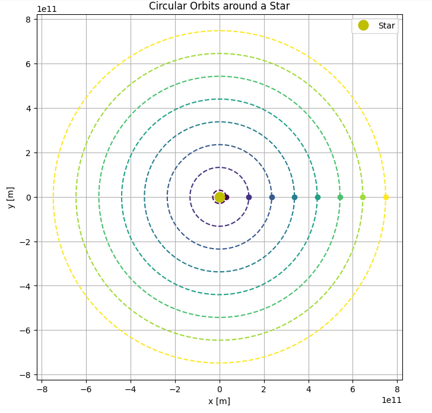

# Problem 1

# Gravity: Orbital Period and Orbital Radius

## Introduction

The motion of celestial bodies has long fascinated scientists and thinkers. Among the most foundational relationships in celestial mechanics is the link between an object's orbital period and its distance from the central mass it orbits. This connection, formalized as Kepler's Third Law, reveals that the square of the orbital period is proportional to the cube of the orbital radius. It serves as a vital bridge between Newton's law of gravitation and observed planetary motion.

Understanding and deriving this law for circular orbits not only sharpens our grasp of gravitational principles but also has direct applications in calculating the masses of planets and stars, determining satellite trajectories, and understanding the dynamics of stellar systems. In this report, we delve into the theoretical derivation of this relationship, examine its implications in astronomy, and use real-world data to explore its validity.

---

## Theoretical Background

### Newton's Law of Universal Gravitation

Newton postulated that any two masses attract each other with a force proportional to the product of their masses and inversely proportional to the square of the distance between them:

$$
F_g = \frac{G M m}{r^2}
$$

Where:

- $F_g$ is the gravitational force

- $G$ is the gravitational constant $(6.67430 \times 10^{-11}\, \mathrm{m}^3\, \mathrm{kg}^{-1}\, \mathrm{s}^{-2})$

- $M$ is the mass of the central object (e.g., a planet or star)

- $m$ is the mass of the orbiting object (e.g., a satellite or moon)

- $r$ is the radius of the orbit (distance between the centers of the two bodies)

### Centripetal Force for Circular Motion

An object moving in a circle with constant speed is accelerating toward the center of the circle. The force that causes this acceleration is called the centripetal force, and it is given by:

$$
F_c = \frac{m v^2}{r}
$$

Where:

- $v$ is the orbital speed of the object

- $m$ and $r$ are as defined above

### Equating Gravitational and Centripetal Force

For a stable circular orbit, the gravitational force provides the necessary centripetal force to keep the object in orbit:

$$
F_g = F_c
$$

Substitute the expressions for both forces:

$$
\frac{G M m}{r^2} = \frac{m v^2}{r}
$$

Cancel $m$ from both sides (assuming $m \ne 0$):

$$
\frac{G M}{r^2} = \frac{v^2}{r}
$$

Multiply both sides by $r$:

$$
\frac{G M}{r} = v^2
$$

### Expressing Orbital Velocity in Terms of Period

The orbital period $T$ is the time it takes to make one complete orbit. The velocity $v$ in a circular orbit can also be written in terms of $T$:

$$
v = \frac{2\pi r}{T}
$$

Substitute into the previous equation:

$$
\frac{G M}{r} = \left( \frac{2\pi r}{T} \right)^2
$$

Simplify the right-hand side:

$$
\frac{G M}{r} = \frac{4\pi^2 r^2}{T^2}
$$

Multiply both sides by $r$:

$$
G M = \frac{4\pi^2 r^3}{T^2}
$$

Rearrange to solve for $T^2$:

$$
T^2 = \frac{4\pi^2}{G M} r^3
$$

### Final Form: Kepler’s Third Law for Circular Orbits

This final equation expresses Kepler’s Third Law for circular orbits:

$$
T^2 \propto r^3
$$

This relationship shows that, for any object orbiting a much larger mass under gravity in a circular orbit, the square of the orbital period is directly proportional to the cube of the orbital radius.

---

## Implications in Astronomy

Kepler’s Third Law has significant practical applications in astronomy and space science:

- **Calculating Masses**: If the orbital radius and period of a satellite or moon are known, one can rearrange the equation to solve for the central mass:

  $$
  M = \frac{4\pi^2 r^3}{G T^2}
  $$

- **Determining Distances**: In planetary systems where the central mass is known, this law helps estimate distances between celestial bodies and their orbits.

- **Comparing Planets**: For planets orbiting the same star (like the Sun), the proportional constant $\frac{4\pi^2}{GM}$ is the same, so comparing $T^2$ and $r^3$ across planets becomes simple.

- **Understanding Orbital Dynamics**: It provides insight into how orbital speed and time change with distance, essential for designing satellite trajectories or interplanetary missions.

---

## Real-World Examples

### The Moon's Orbit Around Earth

The Moon orbits Earth approximately every 27.3 days at a distance of about 384,400 km. Plugging these values into the derived formula:

- $T = 27.3 \times 24 \times 3600 = 2.36 \times 10^6$ seconds

- $r = 3.844 \times 10^8$ meters

We can estimate Earth’s mass:

$$
M = \frac{4\pi^2 r^3}{G T^2}
$$

Calculating yields a value close to the known mass of Earth ($\approx 5.97 \times 10^{24}$ kg).

### Planets in the Solar System

By plotting the orbital periods and distances of the planets (with radius in AU and time in Earth years), the graph of $T^2$ vs $r^3$ yields a straight line, further confirming the law. This also helps identify anomalies or perturbations caused by other forces (e.g., gravity from nearby planets).

---

## Simulation

To verify Kepler’s Third Law computationally, we developed a Python simulation using Newtonian mechanics. The simulation models a set of hypothetical planets in circular orbits around a central star. While the orbital parameters are not based on real planetary data, they are designed to span a realistic range—from close-in orbits similar to Mercury's to distances slightly beyond Jupiter.

The orbits are computed assuming only gravitational interaction with the central star, using the simplified form of Newton’s law of gravitation. For each orbit, the orbital period is calculated from the formula:

$$
T = 2\pi \sqrt{\frac{r^3}{G M}}
$$

Where:

- $T$ is the orbital period,

- $r$ is the orbital radius,

- $G$ is the gravitational constant,

- $M$ is the mass of the central body (the Sun in this case).

You can try simulating yourself [here](https://colab.research.google.com/github/OlehVorobiov/solutions_repo/blob/main/docs/Interactives/KeplersLaw.ipynb)

The visual output of the simulation includes two key components:

### Circular Orbits

This figure shows eight circular orbits of increasing radii around a central star. Each orbit is marked with a point representing a planet at a fixed position on its path. The central yellow dot represents the star (Sun). The orbits are not scaled to real planetary distances but were chosen to demonstrate the consistent growth in orbital radius and corresponding period.

### Period-Radius Relationship

This graph plots the square of the orbital period ($T^2$) against the cube of the orbital radius ($r^3$). The result is a nearly perfect straight line, confirming the proportionality described by Kepler’s Third Law:

$$
T^2 \propto r^3
$$

This computational confirmation illustrates how Newtonian gravity naturally produces the laws of planetary motion. Even with synthetic data, the simulation captures the elegant linearity between time and space that governs celestial orbits.

## Extension to Elliptical Orbits and Other Celestial Bodies

Kepler originally formulated his third law based on empirical observations of elliptical orbits, not perfect circles. While our derivation and simulation focused on circular motion for simplicity, the law extends to elliptical orbits as well. In fact, the generalized version of Kepler's Third Law is:

$$
T^2 \propto a^3
$$

Where:

- $T$ is the orbital period,

- $a$ is the semi-major axis of the elliptical orbit (the average of the closest and farthest distances from the central body).

This generalized form remains valid for all bound orbits governed by gravity, regardless of eccentricity. The only change is that $r$, the fixed radius in a circular orbit, is replaced by $a$, the semi-major axis.

### Applicability Beyond Planets

Kepler’s Third Law, when derived from Newton's laws, applies not just to planets orbiting stars but to any two-body system dominated by gravity:

- **Moons** orbiting planets (e.g., the Moon around Earth)

- **Satellites** orbiting Earth or other bodies

- **Binary star systems**

- **Exoplanets** around distant stars

In each of these cases, as long as the mass of the orbiting body is much smaller than that of the central body (or if reduced mass is used), the relationship holds with high precision. In more complex systems—like multiple stars or galaxies—perturbations, relativistic effects, and mass distributions can introduce deviations, but Newtonian gravity and Kepler’s insight still form the foundational approximation.

---

## Conclusion

In this report, we derived and explored Kepler’s Third Law using Newtonian mechanics, demonstrating the proportionality between the square of the orbital period and the cube of the orbital radius for circular orbits. Through theoretical derivation, astronomical applications, real-world examples, and computational simulation, we confirmed the law’s validity and practical significance.

The relationship:

$$
T^2 = \frac{4\pi^2}{GM} r^3
$$

emerged naturally from equating gravitational and centripetal forces. We showed that it not only explains planetary motion but also allows us to calculate celestial masses and design satellite orbits.

The computational model and visualizations provided intuitive insight into how orbits behave under gravity. Finally, we extended the discussion to elliptical orbits and broader gravitational systems, reinforcing the universality of this principle.

Kepler’s Third Law remains a cornerstone of classical mechanics and a gateway to understanding more advanced topics in astrophysics, orbital mechanics, and space exploration.
