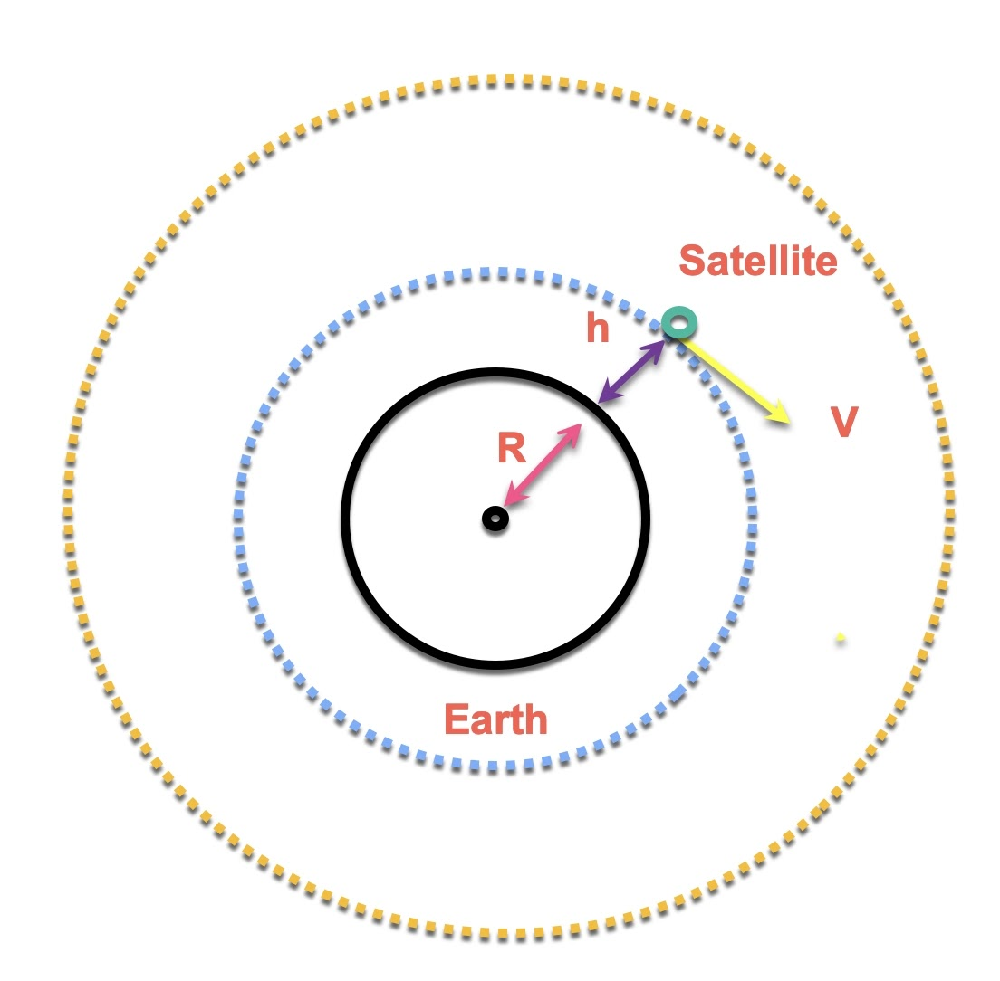
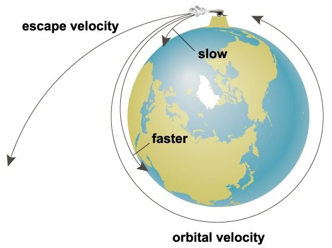
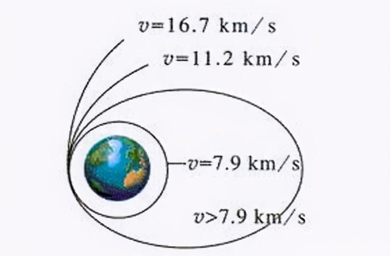
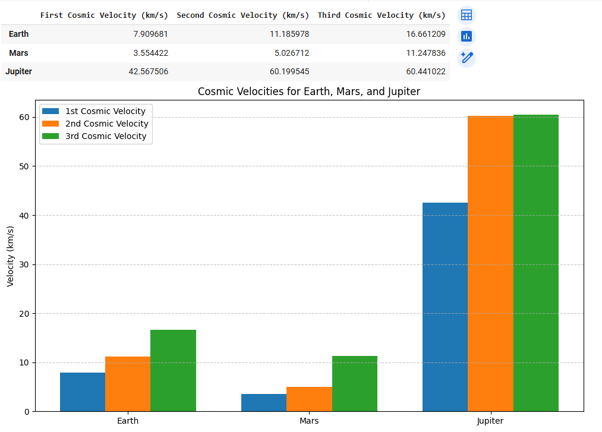

# Problem 2

# Escape and Cosmic Velocities – The Physics of Leaving Worlds

## 1. Introduction

Gravity is the fundamental force that binds celestial bodies and governs the motion of objects across the universe. To leave the influence of a planet or star, a spacecraft must overcome this gravitational pull—a challenge that lies at the heart of spaceflight.

This report explores the concepts of **escape velocity** and the three so-called **cosmic velocities**, which define key thresholds in orbital mechanics:

- The **first cosmic velocity** is the minimum speed needed to maintain a stable orbit around a body.

- The **second cosmic velocity** is the speed required to escape the gravitational influence of a body entirely.

- The **third cosmic velocity** is the speed required to leave the gravitational influence of a star from a planet's orbit.

Understanding and calculating these velocities is essential for planning satellite launches, interplanetary missions, and, one day, interstellar travel.

---

## 2. Theoretical Background

### 2.1 Escape Velocity: General Concept

Escape velocity is the **minimum speed** an object must reach to **break free** from a celestial body’s gravitational field **without further propulsion**.

To derive this, consider a body of mass $m$ on the surface of a planet of mass $M$ and radius $r$. The total mechanical energy (kinetic + potential) must be zero or positive for the object to escape. At the escape point (infinite distance), kinetic and potential energies are both zero.

Using conservation of energy:

- **Initial Energy (on surface):**

$$
E_{\text{initial}} = \frac{1}{2}mv^2 - \frac{GMm}{r}
$$

- **Final Energy (at infinity):**

$$
E_{\text{final}} = 0
$$

Setting total energy to zero:

$$
\frac{1}{2}mv^2 - \frac{GMm}{r} = 0
$$

Solve for $v$:

$$
\frac{1}{2}mv^2 = \frac{GMm}{r}
$$

Cancel $m$ from both sides:

$$
\frac{1}{2}v^2 = \frac{GM}{r}
$$

Multiply both sides by 2:

$$
v^2 = \frac{2GM}{r}
$$

Finally:

$$
\boxed{v_{\text{escape}} = \sqrt{\frac{2GM}{r}}}
$$

This is the **escape velocity**. Notably, it does **not** depend on the object's mass $m$, only on the planet's mass $M$ and radius $r$.

---

### 2.2 Cosmic Velocities: Definitions and Physical Meaning

The term **cosmic velocity** refers to specific velocity thresholds necessary for different gravitational maneuvers near a celestial body.

#### First Cosmic Velocity ($v_1$) – Orbital Speed

This is the **minimum speed needed to achieve a stable circular orbit** around a celestial body just above its surface (neglecting atmospheric drag).

For a circular orbit, the gravitational force provides the necessary centripetal force:

$$
\frac{GMm}{r^2} = \frac{mv^2}{r}
$$

Cancel $m$:

$$
\frac{GM}{r^2} = \frac{v^2}{r}
$$

Multiply both sides by $r$:

$$
\frac{GM}{r} = v^2
$$

Thus:

$$
\boxed{v_1 = \sqrt{\frac{GM}{r}}}
$$

This velocity is approximately **7.9 km/s** near Earth's surface. It’s the speed used for satellites like the ISS.

---

#### Second Cosmic Velocity ($v_2$) – Escape Speed

As derived earlier, the second cosmic velocity is simply:

$$
\boxed{v_2 = \sqrt{\frac{2GM}{r}}}
$$

This is the speed needed to **break free from the planet's gravity** without further propulsion. For Earth, this is about **11.2 km/s**.

Note: $v_2 = \sqrt{2} \cdot v_1$

---

#### Third Cosmic Velocity ($v_3$) – Solar System Escape Speed

The third cosmic velocity is the **minimum speed required to escape the Sun's gravity** starting from a planet's orbit (e.g., Earth). It's calculated similarly to the escape velocity but with respect to the Sun.

Assume the spacecraft has already escaped Earth and is orbiting the Sun at Earth’s orbital radius ($r = 1 \, \text{AU} = 1.496 \times 10^{11} \, \text{m}$).

Then:

$$
v_3 = \sqrt{\frac{2GM_{\odot}}{r}}
$$

Where:

- \( G = 6.674 \times 10^{-11} \, \text{m}^3/\text{kg} \cdot \text{s}^2 \)

- \( M_{\odot} = 1.989 \times 10^{30} \, \text{kg} \)

Plugging in the numbers:

$$
v_3 = \sqrt{ \frac{2 \cdot 6.674 \times 10^{-11} \cdot 1.989 \times 10^{30}}{1.496 \times 10^{11}} } \approx \sqrt{1.77 \times 10^9} \approx 42.1 \, \text{km/s}
$$

This is the escape velocity from the Sun at Earth's distance.

Now, Earth is already moving around the Sun at about **29.8 km/s**, so to escape the solar system, a spacecraft only needs to gain:

$$
\Delta v = 42.1 - 29.8 = 12.3 \, \text{km/s}
$$

However, if launching from Earth’s **surface**, the spacecraft must first overcome Earth’s gravity (escape velocity \( v_2 \approx 11.2 \, \text{km/s} \)).

To estimate the total velocity needed to escape the solar system from Earth’s surface, we can combine these two requirements using the Pythagorean sum (since they're roughly perpendicular in energy terms):

$$
v = \sqrt{v_2^2 + \Delta v^2} = \sqrt{(11.2)^2 + (12.3)^2} \approx \sqrt{125.4 + 151.3} = \sqrt{276.7} \approx 16.6 \, \text{km/s}
$$

This is where the commonly quoted **16.7 km/s** comes from — it’s an approximate minimum speed needed from Earth’s surface to fully escape the solar system under ideal conditions.

---

## 3. Mathematical Analysis

### 3.1 Derivations Recap

Each cosmic velocity was derived from Newtonian mechanics, assuming:

- Spherical symmetry

- No atmosphere

- No external forces

- No general relativistic effects

To recap:

- **$v_1 = \sqrt{\frac{GM}{r}}$**  
(Circular orbital velocity)

- **$v_2 = \sqrt{\frac{2GM}{r}}$**  
(Escape velocity from the surface)

- **$v_3 = \sqrt{\frac{2GM_{\odot}}{r_{\text{Earth}}}}$**  
(Approximate interstellar escape speed)

These formulas can be applied to **any** spherical celestial body if you know its mass and radius.

---

### 3.2 Parameters and Their Influence

Key parameters:

- $G$: Gravitational constant ($6.674 \times 10^{-11} \, \text{Nm}^2/\text{kg}^2$)

- $M$: Mass of the celestial body

- $r$: Distance from the center of the body (usually its radius)

**Observations:**

- **Heavier planets** (larger $M$) → higher escape/cosmic velocities

- **Larger radius** (larger $r$) → *lower* velocities (since gravity weakens with distance)

- Jupiter, for instance, despite being farther from the Sun, requires very high $v_1$ and $v_2$ due to its massive size

The mathematical relationships are **inverse-square** with distance and **direct** with mass—very sensitive to the planet's physical properties.

---

## 4. Simulation 

To better understand how the cosmic velocities vary between planets, we implemented a simulation using Python. The script calculates the **first**, **second**, and **third cosmic velocities** for three celestial bodies: **Earth**, **Mars**, and **Jupiter**.

The simulation uses the following data for each planet:

- Mass ($M$)  

- Radius ($r$)  

- Orbital radius around the Sun  

- Orbital speed around the Sun

The gravitational constant $G$ is taken as:

$$
G = 6.674 \times 10^{-11} \, \text{m}^3/\text{kg} \cdot \text{s}^2
$$

Using these values, we compute:

- **First Cosmic Velocity ($v_1$):**  
  The speed required to enter a stable circular orbit just above the surface, calculated using:  
  $$
  v_1 = \sqrt{\frac{GM}{r}}
  $$

- **Second Cosmic Velocity ($v_2$):**  
  The escape velocity from the surface of the planet, calculated as:  
  $$
  v_2 = \sqrt{\frac{2GM}{r}}
  $$

- **Third Cosmic Velocity ($v_3$):**  
  The speed needed to escape the gravitational pull of the Sun from the orbit of the planet. The Sun's escape velocity at the planet's orbital radius is calculated with:  
  $$
  v_{solar} = \sqrt{\frac{2GM_{\odot}}{R}}
  $$
  Since the planet is already moving with orbital speed $v_{orbital}$, only the difference $\Delta v = v_{solar} - v_{orbital}$ needs to be added (in energy terms).  
  The total required velocity from the planet’s surface is:  
  $$
  v_3 = \sqrt{v_2^2 + \Delta v^2}
  $$

---

The results are visualized in the bar graph below:

From the graph, we observe the following:

- Jupiter, due to its massive size and strong gravity, requires much higher $v_1$ and $v_2$ compared to Earth and Mars.

- The third cosmic velocity is highest for Earth, not Jupiter, because Earth orbits closer to the Sun and thus requires more energy to escape the Sun’s gravitational well.

- Mars, being lighter and farther from the Sun, has the lowest velocities across the board.

This simulation helps visualize the real challenges of launching from different planets and planning interplanetary or interstellar missions.

You can try simulating yourself [here](https://colab.research.google.com/github/OlehVorobiov/solutions_repo/blob/main/docs/Interactives/CosmicVelocity.ipynb)

## 5. Applications in Space Exploration

The concept of cosmic velocities has direct and critical applications in modern spaceflight and mission planning. Each velocity threshold represents a fundamental challenge engineers must overcome to achieve various levels of orbital and interplanetary travel.

---

### 5.1 Launching Satellites – First Cosmic Velocity

To place satellites in orbit around Earth (or any planet), a spacecraft must achieve at least the **first cosmic velocity**. This speed is what allows satellites to continuously fall around the planet due to gravity without ever hitting the surface.

Examples:

- The International Space Station (ISS) orbits at approximately 7.66 km/s.

- GPS satellites, weather satellites, and communication satellites all rely on reaching this speed to maintain low-Earth or geosynchronous orbits.

Rocket launches are engineered to gradually accelerate through the atmosphere and reach this velocity at the desired altitude, taking atmospheric drag and rotation of the Earth into account.

---

### 5.2 Interplanetary Missions – Second Cosmic Velocity

To send a spacecraft beyond Earth—toward the Moon, Mars, or the outer planets—it must exceed the **second cosmic velocity**, or escape velocity from Earth. This allows the spacecraft to leave Earth’s gravitational influence and enter a solar orbit.

Historical examples:

- **Apollo missions**: The Saturn V had to push the command module to speeds above 11.2 km/s to reach the Moon.

- **Mars rovers** and orbiters must first escape Earth’s gravity before initiating transfer orbits to Mars.

While gravitational assists (like flybys) and multi-stage rockets help reduce direct fuel costs, $v_2$ is still the baseline challenge for any interplanetary launch.

---

### 5.3 Interstellar Prospects – Third Cosmic Velocity

The **third cosmic velocity** represents a much more ambitious goal: escaping the gravitational pull of the entire solar system.

Real-world example:

- **Voyager 1** is the only human-made object to have fully achieved this. After gravity assists from Jupiter and Saturn, it reached escape speed and is now traveling through interstellar space.

- **New Horizons**, which flew past Pluto, is also on an escape trajectory but will take much longer to leave the heliosphere.

Achieving this velocity directly from Earth is extremely energy-intensive. That’s why missions usually build up speed using planetary flybys or other orbital maneuvers rather than brute-force launches.

The third cosmic velocity sets the theoretical lower bound for **interstellar travel**—one of the final frontiers of human exploration.

---

## 6. Conclusion

This report explored the theoretical and practical aspects of **cosmic velocities**, grounding each concept in physical laws and demonstrating their application to real-world spaceflight.

We derived:

- The **first cosmic velocity** as the orbital speed near the surface.

- The **second cosmic velocity** as the escape speed from a celestial body.

- The **third cosmic velocity** as the speed needed to leave the solar system.

Through simulation, we compared how these velocities vary for Earth, Mars, and Jupiter, reinforcing how a planet’s mass and distance from the Sun affect mission requirements.

Finally, we connected these velocities to key phases of space exploration:

- Satellite deployment

- Planetary missions

- Interstellar probes

Understanding these velocity thresholds is not just academic—it’s essential for designing efficient launch systems, reducing energy costs, and exploring beyond Earth. As we push further into space, these classical mechanics continue to define the boundaries of the possible.

