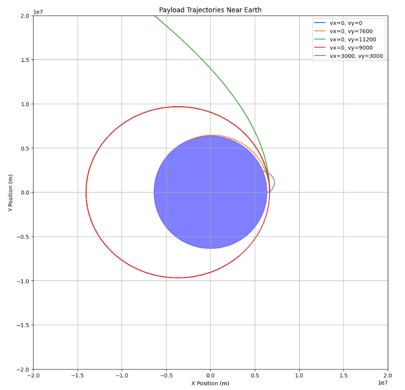

# Problem 3

# Trajectories of a Freely Released Payload Near Earth

## Introduction

When an object is released from a moving rocket near Earth, its trajectory is determined by the gravitational pull of the Earth and the object's initial velocity and position. Understanding these trajectories is essential in space mission design, particularly for satellite deployment, reentry planning, and escape maneuvers.

This report analyzes the physical principles governing these trajectories, focusing on the classification of orbital paths—elliptical, parabolic, or hyperbolic—and the factors influencing them. We then establish a mathematical model to simulate the payload's motion under Earth's gravity.

## Theoretical Background

### Newtonian Gravity

The force between two masses under Newtonian gravity is given by:

$$
F = G \frac{m_1 m_2}{r^2}
$$

Where:

- \( F \) is the gravitational force,

- \( G \approx 6.674 \times 10^{-11} \, \text{m}^3\text{kg}^{-1}\text{s}^{-2} \) is the gravitational constant,

- \( m_1 \) and \( m_2 \) are the masses of Earth and the payload,

- \( r \) is the distance between the centers of the two masses.

For a small payload near Earth, the motion is dominated by Earth's gravitational field:

$$
F = m \cdot a = G \frac{M_E m}{r^2} \Rightarrow a = \frac{G M_E}{r^2}
$$

### Gravitational Potential Energy and Escape Velocity

The gravitational potential energy is:

$$
U(r) = -\frac{G M_E m}{r}
$$

The escape velocity from a given distance \( r \) from Earth’s center is derived from setting total mechanical energy to zero:

$$
v_{\text{esc}} = \sqrt{\frac{2 G M_E}{r}}
$$

If the object’s speed exceeds this, it will escape Earth’s gravity.

### Types of Trajectories

The shape of the trajectory depends on the total specific mechanical energy \( \varepsilon \) of the object:

$$
\varepsilon = \frac{v^2}{2} - \frac{G M_E}{r}
$$

- If \( \varepsilon < 0 \): **Bound orbit** (circular or elliptical)

- If \( \varepsilon = 0 \): **Parabolic trajectory** (escape at exactly escape velocity)

- If \( \varepsilon > 0 \): **Hyperbolic trajectory** (unbound escape)

These relate directly to orbital shapes derived from conic sections in central-force problems.

### Orbital Mechanics and Kepler’s Laws

Kepler’s Laws describe planetary motion in bound orbits:

1. Orbits are ellipses with Earth at one focus.

2. The line joining the planet and Earth sweeps out equal areas in equal times.

3. The square of the orbital period is proportional to the cube of the semi-major axis:

$$
T^2 \propto a^3
$$

For payloads near Earth, these laws apply to elliptical orbits under the assumption of two-body motion.

## Equations of Motion

To simulate the motion, we start from Newton’s Second Law in vector form:

$$
\vec{a} = -\frac{G M_E}{r^3} \vec{r}
$$

This second-order differential equation governs the position vector \( \vec{r}(t) \) over time.

To solve numerically, we convert to a system of first-order differential equations. Let:

- \( \vec{r} = (x, y) \)

- \( \vec{v} = \frac{d\vec{r}}{dt} = (v_x, v_y) \)

Then the system becomes:

$$
\frac{dx}{dt} = v_x, \quad \frac{dy}{dt} = v_y
$$

$$
\frac{dv_x}{dt} = -\frac{G M_E x}{(x^2 + y^2)^{3/2}}, \quad \frac{dv_y}{dt} = -\frac{G M_E y}{(x^2 + y^2)^{3/2}}
$$

This system will be integrated numerically using Python in the next section.

## Assumptions and Simplifications

To make the problem tractable, we adopt the following assumptions:

- The Earth is a perfect sphere with uniform mass.

- The atmosphere is neglected (vacuum conditions).

- Only Earth's gravity is considered (no third-body effects).

- Motion is planar (2D), with the Earth's center at the origin.

- The payload's mass is negligible compared to Earth (two-body approximation).

## Simulation

You can try simulating yourself [here](https://colab.research.google.com/github/OlehVorobiov/solutions_repo/blob/main/docs/Interactives/PayloadTrajectorySimulation.ipynb)

This simulation visualizes various trajectories of a payload released near Earth at an altitude of 300 km. Each path corresponds to a different set of initial velocity conditions, demonstrating how these affect the outcome:

- **Free fall (vx=0, vy=0):** The payload follows a straight downward path under gravity, crashing back into Earth.

- **Circular orbit (vx=0, vy=7600 m/s):** The velocity is approximately equal to the required speed for a low Earth orbit, producing a stable circular trajectory.

- **Escape trajectory (vx=0, vy=11200 m/s):** This velocity matches Earth's escape velocity at 300 km altitude, causing the payload to escape Earth's gravity well.

- **Elliptical orbit (vx=0, vy=9000 m/s):** Higher than orbital speed but lower than escape velocity, resulting in a stretched elliptical orbit.

- **Oblique trajectory (vx=3000, vy=3000 m/s):** With components in both axes, the payload follows a complex elliptical or suborbital path, depending on its total energy.

All trajectories are computed using Newton’s law of universal gravitation with a time-stepped numerical method. The simulation helps illustrate how even small changes in velocity and direction can dramatically alter the payload’s fate—be it orbital insertion, reentry, or escape.

## Applications and Implications

Understanding the trajectories of released payloads is critical for several areas of aerospace engineering and space mission planning:

- **Satellite Deployment**: Precise velocity control is required to insert satellites into stable orbits. A small deviation may result in suborbital reentry or an unintended elliptical orbit.
  
- **Orbital Maneuvers**: Payloads transferred between orbits (e.g., from low Earth orbit to geostationary) follow elliptical transfer paths. These transitions rely on short, calculated bursts (impulses) to adjust velocity.

- **Reentry Scenarios**: Controlled reentry missions (e.g., return capsules or deorbiting satellites) must carefully reduce velocity to avoid skipping off the atmosphere or burning up. Trajectory modeling helps define safe reentry corridors.

- **Escape Missions**: Missions aiming to leave Earth’s gravity (e.g., interplanetary probes) must achieve escape velocity. The simulation illustrates how exceeding critical energy thresholds leads to hyperbolic escape paths.

- **Space Debris Risk Assessment**: Modeling trajectories of malfunctioning or deorbited payloads helps predict impact zones or decay paths, crucial for safety and mitigation planning.

These applications reveal how orbital mechanics and gravitational modeling directly influence mission success, cost, and safety.

## Conclusion

This report analyzed the motion of a payload released near Earth under the influence of gravity. Using Newtonian mechanics, we derived the fundamental equations governing gravitational acceleration and related them to conic-section trajectory types.

A numerical simulation was conducted in Python to visualize the paths resulting from various initial conditions, clearly showing transitions between suborbital reentry, stable orbit, and escape. The results underscore the sensitivity of trajectories to initial velocity and direction, highlighting the importance of precise control in orbital mechanics.

Overall, this exercise not only provides a deeper understanding of celestial dynamics but also demonstrates the practical significance of trajectory modeling in real-world aerospace operations.

