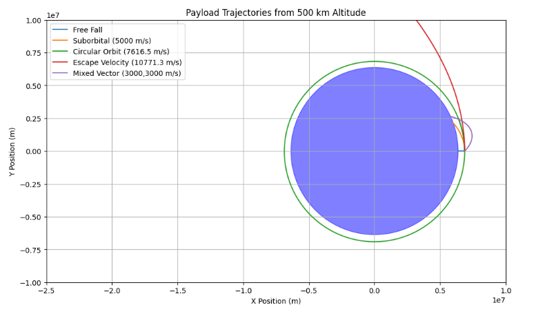

# Problem 3

# Trajectories of a Freely Released Payload Near Earth

## Introduction

When a payload is released from a spacecraft near Earth, its motion is determined by Earth's gravity. Depending on its initial speed and direction, it can fall back to Earth, enter a stable orbit, or escape Earth’s gravitational field.

This project simulates and analyzes such trajectories using Newtonian mechanics and numerical methods. The goal is to develop a tool that models the payload’s motion, visualizes its path, and classifies the resulting trajectory. This analysis is directly relevant to applications like satellite deployment, reentry planning, and escape missions.

## Theoretical Background

### Gravitational Force

The gravitational force acting on a payload of mass $m$ at a distance $r$ from Earth’s center is:

$$
F = \frac{G M m}{r^2}
$$

where:

- $G = 6.67430 \times 10^{-11} \, \text{m}^3/\text{kg}/\text{s}^2$ is the gravitational constant,

- $M = 5.972 \times 10^{24} \, \text{kg}$ is Earth’s mass,

- $r$ is the distance from the payload to Earth's center.

This force causes a radial acceleration:

$$
\vec{a} = -\frac{G M}{r^2} \hat{r}
$$

pointing toward the center of Earth.

### Total Mechanical Energy

The total mechanical energy $E$ of the payload combines kinetic and gravitational potential energy:

$$
E = \frac{1}{2} m v^2 - \frac{G M m}{r}
$$

The sign of $E$ determines the type of trajectory:

- $E < 0$: elliptical orbit,

- $E = 0$: parabolic escape,

- $E > 0$: hyperbolic escape.

A circular orbit occurs when gravitational force exactly balances the centripetal force:

$$
v = \sqrt{\frac{G M}{r}}
$$

### Equations of Motion

To simulate how the payload moves after release, we need to describe how its position and velocity change over time due to Earth's gravity.

We model the payload's position in 2D space as a vector:

$$
\vec{r}(t) = \begin{bmatrix} x(t) \\ y(t) \end{bmatrix}
$$

This means the object has an $x$ and $y$ coordinate at each moment in time. Earth's center is fixed at the origin $(0, 0)$, so gravity always pulls the object toward that point.

From Newton’s Second Law:

$$
\vec{F} = m \vec{a}
$$

And from Newton’s Law of Universal Gravitation:

$$
\vec{F}_{\text{gravity}} = -\frac{GMm}{r^2} \hat{r}
$$

Here:

- $G$ is the gravitational constant,

- $M$ is Earth’s mass,

- $m$ is the payload’s mass,

- $r$ is the **distance** from the payload to Earth’s center,

- $\hat{r}$ is the **unit vector** pointing from the payload toward Earth’s center.

The **unit vector** $\hat{r}$ tells us only the direction of gravity (not its strength). Since $\vec{r}$ is the position vector pointing from Earth’s center to the payload, the unit vector pointing **back** toward Earth is:

$$
\hat{r} = \frac{\vec{r}}{|\vec{r}|} = \frac{\vec{r}}{r}
$$

Substituting this into the force equation:

$$
\vec{F}_{\text{gravity}} = -\frac{GMm}{r^2} \cdot \frac{\vec{r}}{r} = -\frac{GMm}{r^3} \vec{r}
$$

Now apply Newton’s second law, $\vec{F} = m \vec{a}$:

$$
m \vec{a} = -\frac{GMm}{r^3} \vec{r}
$$

Divide both sides by $m$ to get acceleration:

$$
\vec{a} = \frac{d^2 \vec{r}}{dt^2} = -\frac{GM}{r^3} \vec{r}
$$

This is a vector equation — it tells us how the acceleration behaves based on the current position.

To actually simulate this numerically, we write it in terms of $x$ and $y$.

Since:

$$
r = \sqrt{x^2 + y^2}, \quad \vec{r} = \begin{bmatrix} x \\ y \end{bmatrix}
$$

we substitute into the acceleration formula:

$$
\frac{d^2 \vec{r}}{dt^2} = -\frac{GM}{(x^2 + y^2)^{3/2}} \begin{bmatrix} x \\ y \end{bmatrix}
$$

So in component form:

$$
\frac{d^2 x}{dt^2} = -\frac{GM x}{(x^2 + y^2)^{3/2}}, \quad 
\frac{d^2 y}{dt^2} = -\frac{GM y}{(x^2 + y^2)^{3/2}}
$$

These two equations give the **acceleration** of the payload in each direction, based on its current position.

#### Converting to First-Order System

To simulate this with a computer, we convert the second-order differential equations into a system of **first-order equations** by introducing velocity:

Let:

$$
v_x = \frac{dx}{dt}, \quad v_y = \frac{dy}{dt}
$$

Then we get:

**Velocity equations (define position from velocity):**

$$
\frac{dx}{dt} = v_x, \quad \frac{dy}{dt} = v_y
$$

**Acceleration equations (define velocity from position):**

$$
\frac{dv_x}{dt} = -\frac{GM x}{(x^2 + y^2)^{3/2}}, \quad 
\frac{dv_y}{dt} = -\frac{GM y}{(x^2 + y^2)^{3/2}}
$$

---

### Numerical Integration

These four equations are used to simulate the motion step by step in time using a numerical method such as:

- **Euler’s method** (simple, but less accurate),

- or **Runge-Kutta** (more accurate and stable).

At each small time interval $dt$, the process is:

1. Use the current $x$ and $y$ to compute acceleration.

2. Update $v_x$ and $v_y$ using the acceleration.

3. Update $x$ and $y$ using the new velocity.

4. Repeat.

This step-by-step method lets us trace the full trajectory of the payload over time, depending on its initial position and velocity.

## Simulation

The simulation uses a simple Euler integrator with time step Δt = 10 s over a total duration of 6 000 s. The payload is released from **500 km** altitude (  
$$
r_0 = R_\text{earth} + 500\,\text{km}
$$  

 with five different initial velocity vectors:

- **Free Fall**: vₓ = 0, vᵧ = 0  

- **Suborbital**: vₓ = 0, vᵧ = 5 000 m/s  

- **Circular Orbit**: vₓ = 0, vᵧ ≃ √(GM/r₀) ≃ 7 600 m/s  

- **Escape Velocity**: vₓ = 0, vᵧ ≃ √(2GM/r₀) ≃ 10 800 m/s  

- **Mixed Vector**: vₓ = 3 000 m/s, vᵧ = 3 000 m/s  

Below is the resulting plot (insert your generated figure here):

You can try simulating yourself [here](https://colab.research.google.com/github/OlehVorobiov/solutions_repo/blob/main/docs/Interactives/PayloadTrajectorySimulation.ipynb)

---

## Results and Interpretation

- **Free Fall**  
  With zero initial speed, the payload drops straight down and impacts Earth rapidly (within a few minutes). This confirms the expected radial infall when no tangential velocity is provided.

- **Suborbital (5 000 m/s)**  
  The payload follows a ballistic arc: it climbs slightly, then falls back, reentering well before completing a full revolution. Since 5 000 m/s is below the circular speed at 500 km, the energy is negative (E < 0) but the angular momentum is too low to sustain orbit.

- **Circular Orbit (≈7 600 m/s)**  
  At roughly √(GM/r₀), gravity exactly provides the centripetal force. The trajectory is nearly a perfect circle at constant radius r₀, illustrating a stable bound orbit (E < 0).

- **Escape Velocity (≈10 800 m/s)**  
  When v ≃ vₑₛc, the specific energy E ≃ 0, producing a parabolic escape path. The payload climbs indefinitely, slowing as it climbs, and would reach zero speed at infinite distance.

- **Mixed Vector (3 000,3 000 m/s)**  
  The resultant speed (~4 240 m/s) is below the circular threshold, so the path is an eccentric ellipse. However, its perigee dips below Earth's surface, causing reentry. This underscores how both magnitude and direction critically shape the orbit.

---

**Key takeaway:**  
Small changes in initial velocity magnitude or direction at release altitude can switch the payload’s fate from immediate impact, to a stable orbit, or to escape. This highlights the precision required in satellite deployment and reentry planning.

## Conclusion

This study has shown how a payload released near Earth can follow dramatically different paths—impact, suborbital arc, bound orbit, or escape—depending on its initial velocity magnitude and direction. By modeling the motion with Newton’s law of gravitation and integrating the resulting first-order system numerically, we illustrated:

- **Free fall** when no tangential speed is provided.  

- **Ballistic suborbital** trajectories when speed is insufficient for a full revolution.  

- **Stable circular orbit** at the precise velocity where gravity supplies exactly the required centripetal force.  

- **Parabolic escape** at the escape speed, marking the boundary between bound and unbound motion.  

- **Eccentric ellipse** for off-axis or intermediate speeds, which may intersect the atmosphere if perigee dips too low.

The sharp sensitivity of the outcome to even small changes in initial conditions underscores the precise control needed in real mission scenarios—whether deploying satellites, planning reentry, or aiming for interplanetary escape. Future work could refine this model by adding atmospheric drag, higher-order integration (Runge-Kutta), or 3D dynamics, but the core lesson remains: in orbital mechanics, a small delta-v can change everything.  
