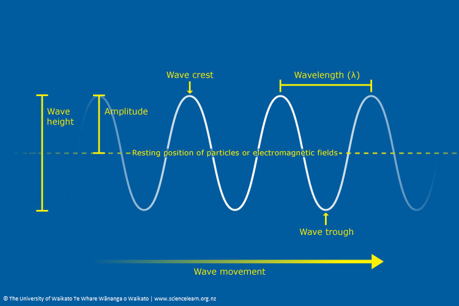

# Problem 1

# Introduction

## Motivation

Waves are fundamental to understanding various physical phenomena, from ocean waves to sound and light. One of the most intriguing aspects of wave behavior is **interference**, which occurs when multiple waves overlap, leading to distinctive patterns of reinforcement and cancellation. This effect is particularly visible on the surface of the water, where ripples from different sources meet and interact.

Studying these interference patterns provides valuable insight into the principles of wave superposition, phase relationships, and coherence. These concepts are not only essential in fluid dynamics but also play a crucial role in optics, acoustics, and even quantum mechanics. By analyzing how waves combine on a water surface, we can develop a deeper understanding of wave behavior in a simple yet visually demonstrative manner.

## Objective

This report aims to analyze the interference patterns formed by circular waves originating from multiple point sources arranged at the vertices of a regular polygon. By modeling and simulating these patterns, we will investigate how constructive and destructive interference regions emerge as a result of wave superposition. Additionally, we will explore how the number of sources and their spatial arrangement influence the complexity of the interference pattern.

To achieve this, we will:
- Define the mathematical framework for wave propagation and interference.
- Develop a computational model to simulate wave superposition.
- Visualize and interpret the resulting interference patterns for different polygonal configurations.

Through this approach, we will gain practical insights into wave behavior and the fundamental principles governing interference, enhancing our comprehension of both theoretical and applied wave physics.

# Fundamental Concepts of Waves

## Wave Properties

Waves are characterized by several fundamental properties that define their behavior:

- **Amplitude (A)**: The maximum displacement of the wave from its equilibrium position. It determines the wave's intensity or energy.

- **Wavelength (λ)**: The distance between two consecutive points that are in phase (e.g., crest to crest or trough to trough).

- **Frequency (f)**: The number of wave cycles that pass a given point per unit time, measured in hertz (Hz).

- **Wave Number (k)**: Defined as \( k = \frac{2\pi}{\lambda} \), it represents the spatial frequency of the wave.

- **Phase ($\phi$)**: The position of a point within the wave cycle at a given time.

