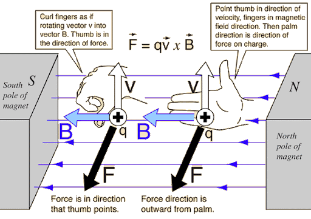
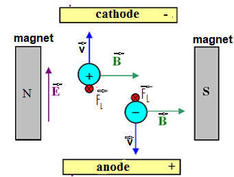
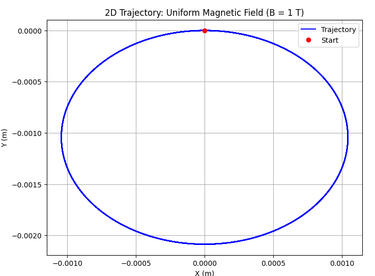
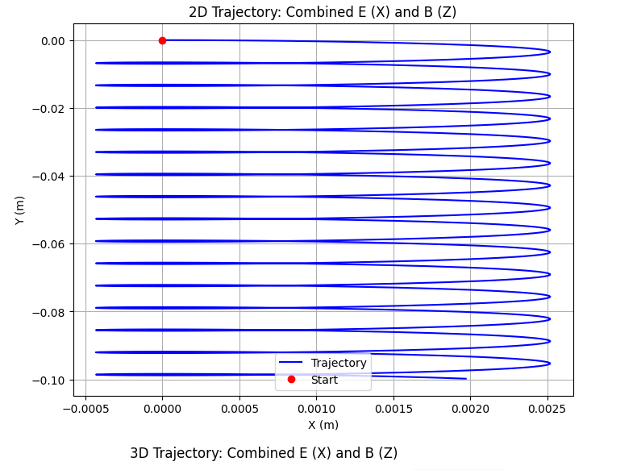
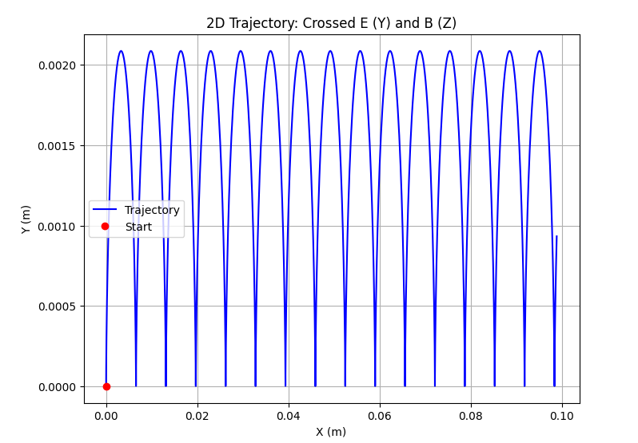
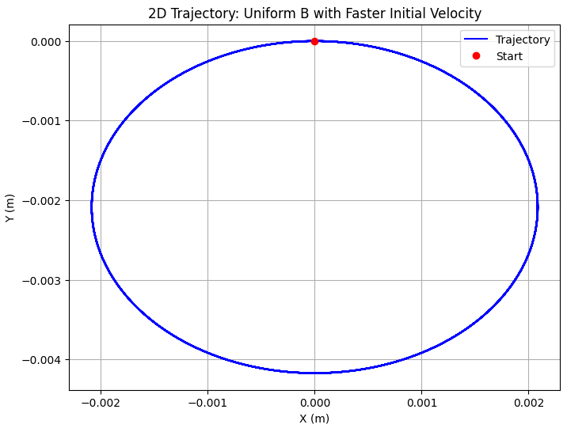

# Simulating the Effects of the Lorentz Force on Charged Particle Motion

## Introduction

The motion of charged particles in electromagnetic fields lies at the heart of many physical phenomena and technologies. At the center of this interaction is the **Lorentz force**, which describes how electric and magnetic fields influence the trajectory of a particle with charge $q$. The force is given by:

$$
\vec{F} = q(\vec{E} + \vec{v} \times \vec{B})
$$

where $\vec{F}$ is the total force acting on the particle, $\vec{E}$ is the electric field, $\vec{B}$ is the magnetic field, and $\vec{v}$ is the particle's velocity.

This force law is not just a theoretical construct; it is the foundation of systems ranging from mass spectrometers and cyclotrons to magnetic traps and plasma confinement devices. Its applications stretch across disciplines — from accelerator physics and electromagnetism to space science and medical imaging.

Despite its relatively simple mathematical form, the Lorentz force leads to complex and sometimes counterintuitive particle trajectories, especially when both electric and magnetic fields are involved. Analytically solving the equations of motion in such cases is often impractical or impossible. That is where computational methods become indispensable.

The goal of this project is to explore the effects of the Lorentz force through **numerical simulations**. By visualizing how particles move under different configurations of $\vec{E}$ and $\vec{B}$ fields, we gain a more intuitive understanding of the physics involved. The simulations will include cases such as uniform magnetic fields, crossed electric and magnetic fields, and combinations thereof. Parameters like field strength, initial velocity, charge, and mass will be varied to observe their impact on motion.

Ultimately, this work aims to bridge theory and application — providing insights not only into particle dynamics but also into the operation of devices that harness these fundamental physical principles.

## Theoretical Background

The behavior of charged particles in electric and magnetic fields is governed by the **Lorentz force**, which acts as the fundamental law of motion in electromagnetic systems. The total force $\vec{F}$ acting on a particle with charge $q$ and velocity $\vec{v}$ in the presence of electric field $\vec{E}$ and magnetic field $\vec{B}$ is given by:

$$
\vec{F} = q(\vec{E} + \vec{v} \times \vec{B})
$$

This expression combines the effects of the electric force $q\vec{E}$ and the magnetic force $q(\vec{v} \times \vec{B})$. The resulting trajectory of the particle depends on the initial velocity, the magnitude and direction of the fields, and the particle’s charge and mass.

### Equation of Motion

From Newton’s second law, the acceleration of the particle is:

$$
\vec{a} = \frac{d\vec{v}}{dt} = \frac{\vec{F}}{m}
$$

Substituting the Lorentz force:

$$
\frac{d\vec{v}}{dt} = \frac{q}{m} (\vec{E} + \vec{v} \times \vec{B})
$$

This is a system of coupled, first-order differential equations that describe the time evolution of the particle’s velocity. By further integrating, we can obtain the position:

$$
\frac{d\vec{r}}{dt} = \vec{v}
$$

Thus, we have a full system of equations for velocity and position that can be solved numerically.

### Motion in Uniform Fields

1. **Only Magnetic Field Present ($\vec{E} = 0$):**

   In the presence of a uniform magnetic field and no electric field, the particle experiences a force perpendicular to both the velocity and the field direction. This results in **circular or helical motion**. The radius of the circular trajectory, known as the **Larmor radius**, is given by:

   $$
   r_L = \frac{mv_\perp}{|qB|}
   $$

   where $v_\perp$ is the component of velocity perpendicular to the magnetic field.

   The corresponding **cyclotron frequency** (or Larmor frequency) is:

   $$
   \omega_c = \frac{|qB|}{m}
   $$

2. **Only Electric Field Present ($\vec{B} = 0$):**

   The motion becomes purely linear with constant acceleration:

   $$
   \vec{a} = \frac{q\vec{E}}{m}
   $$

3. **Crossed Fields ($\vec{E} \perp \vec{B}$):**

   When both fields are present and perpendicular, the particle exhibits a **drift motion** perpendicular to both $\vec{E}$ and $\vec{B}$. This is known as the **E × B drift**, with velocity:

   $$
   \vec{v}_d = \frac{\vec{E} \times \vec{B}}{B^2}
   $$

   Notably, this drift velocity is **independent of the particle’s charge or mass**.

#### The Right-Hand Rule

To determine the direction of the magnetic component of the Lorentz force, we use the **right-hand rule**:

- Point your **fingers** in the direction of the particle’s velocity $\vec{v}$.
- Curl them toward the direction of the magnetic field $\vec{B}$.
- Your **thumb** then points in the direction of the magnetic force $\vec{F}_L$ **for a positive charge**.
- For **negative charges**, the magnetic force acts in the **opposite direction** to your thumb.

This rule is essential when analyzing particle motion in magnetic fields, especially when electric fields are also present.

*Figure 1: Using the right-hand rule to determine the direction of the magnetic force $\vec{F}_L = q(\vec{v} \times \vec{B})$. For a negative charge, the force is in the opposite direction.*

---

*Figure 2: Motion of positive and negative particles in perpendicular electric and magnetic fields. The Lorentz force $\vec{F}_L$ acts in opposite directions depending on the charge sign.*

These fundamental results form the basis for understanding more complex trajectories and for interpreting the results of simulations. In the following sections, these principles will be applied to numerically simulate and visualize particle motion under various configurations of $\vec{E}$ and $\vec{B}$.

## Trajectories

Scenario 1: Uniform Magnetic Field (B along Z, E = 0)

Scenario 2: Combined Electric and Magnetic Fields

Scenario 3: Crossed Electric and Magnetic Fields (E ⊥ B)

Parameter Exploration: Vary initial velocity

