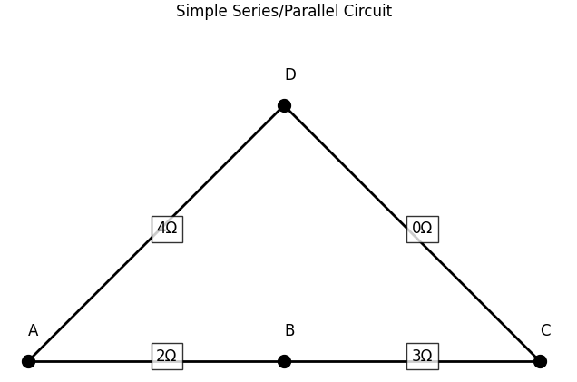
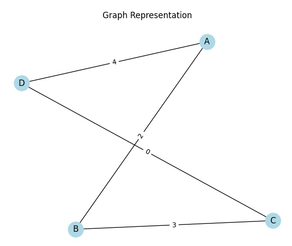
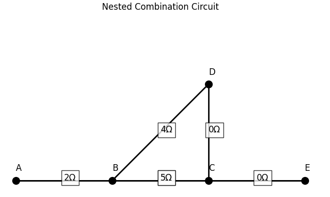
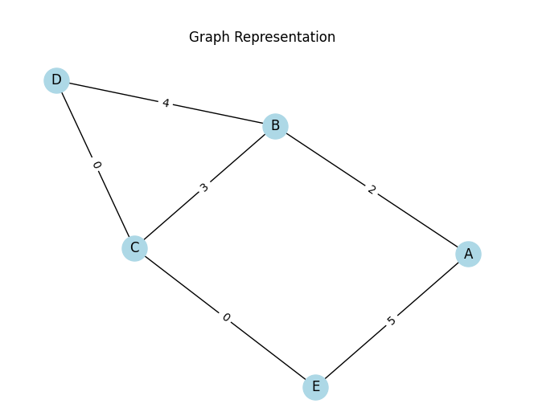
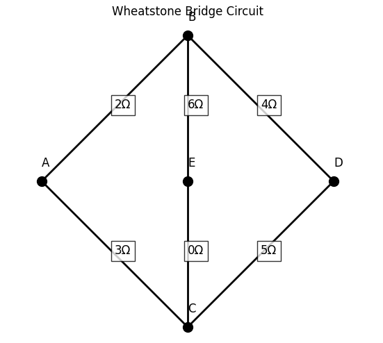
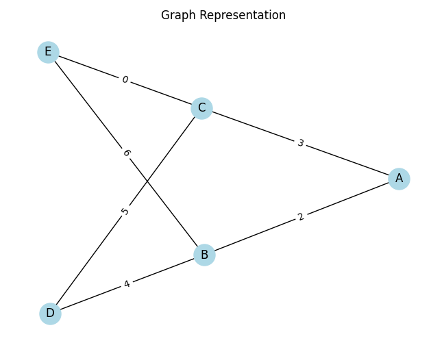

# Equivalent Resistance Using Graph Theory

## 1. Introduction

Calculating the equivalent resistance of an electrical circuit is a fundamental problem in physics and engineering. In simple cases, the problem can be solved manually using rules for series and parallel resistors. However, for more complex networks involving many components and multiple connection patterns, traditional methods become inefficient and error-prone.

Graph theory provides a powerful alternative by modeling the circuit as a graph: nodes represent junctions, and edges represent resistors. This approach enables structured simplification, allows for algorithmic implementation, and is well-suited for automated analysis in modern applications such as circuit simulation software, electrical network design, and optimization.

This report explores how graph theory can be used to calculate equivalent resistance systematically, highlighting the methodology, its advantages, and the computational processes involved.

## 2. Background Theory

### 2.1 Electrical Resistance and Circuit Simplification

- **Ohm’s Law:**  
  $V = IR$, where $V$ is voltage, $I$ is current, and $R$ is resistance.

- **Series Connection:**  
  Resistors connected end-to-end.  
  Total resistance:  
  $$
  R_{\text{eq}} = R_1 + R_2 + \dots + R_n
  $$

- **Parallel Connection:**  
  Resistors connected across the same two nodes.  
  Total resistance:  
  $$
  \frac{1}{R_{\text{eq}}} = \frac{1}{R_1} + \frac{1}{R_2} + \dots + \frac{1}{R_n}
  $$

### 2.2 Graph Theory Fundamentals

- **Graph:** A mathematical structure consisting of nodes (vertices) and connections between them (edges).
- **Undirected Graph:** Each edge does not have a direction; current can flow both ways.
- **Weighted Graph:** Each edge has a value (weight), which in our case represents resistance in ohms.
- **Connectivity:** Paths and cycles in the graph correspond to possible current paths and resistor networks.

## 3. Modeling Circuits as Graphs

### 3.1 Circuit as a Graph

- **Nodes:** Represent junctions where two or more circuit elements meet.
- **Edges:** Represent resistors; each edge has a weight equal to the resistor’s resistance.
- **Example:**  
  A resistor of 4Ω between node A and node B → edge (A, B, weight=4)

### 3.2 Why Use Graphs?

- Structured and algorithm-friendly.
- Works for arbitrary resistor configurations.
- Can be implemented in software.
- Useful for detecting and simplifying patterns like loops and branches.

### 3.3 Assumptions

- All components are resistors (no capacitors, inductors, or sources).
- No directional current enforcement (undirected graph).
- Ideal resistors only; no temperature or frequency dependence.

## 4. Algorithm Design (Conceptual Overview)

### 4.1 Goal

To reduce a circuit graph iteratively by identifying and simplifying:

- Series resistor chains
- Parallel resistor groups
- Nested or compound structures

### 4.2 Key Concepts

- **Series Detection:** A node connected to exactly two other nodes (excluding input/output terminals) likely lies in a series path.
- **Parallel Detection:** Multiple edges between the same pair of nodes indicate parallel resistors.
- **Cycle Detection:** Loops in the graph often represent more complex configurations requiring analysis.

### 4.3 High-Level Steps

1. Represent the circuit as a weighted, undirected graph.
2. Identify and reduce all series connections.
3. Identify and reduce all parallel connections.
4. Repeat until the graph reduces to a single equivalent resistance between input and output nodes.

## 5. Implementation

To carry out the analysis of electrical circuits using graph theory, a [Python implementation](https://colab.research.google.com/github/OlehVorobiov/Math-2024-25-Winter/blob/main/docs/Interactives/CircuitGraph.ipynb) was developed.

Three progressively complex case studies were investigated:

1. A simple **series/parallel** circuit,  
2. **Nested combination circuit**,  
3. **Wheatstone bridge**.

For each case, the implementation displays the original circuit diagram, constructs the corresponding graph, simplifies the circuit step-by-step using series and parallel reduction, and computes the final equivalent resistance.

### Case Studies

- **Case Study 1:** Simple Series/Parallel Circuit
- Description: R1 and R2 in series, in parallel with R3

Equivalent Resistance (A to C): 5.00Ω

---

- **Case Study 2:** Nested Combination Circuit 
- Description: R1 in series with (R2 parallel R3), then parallel with R4

Equivalent Resistance (A to E): 5.00Ω

---

- **Case Study 3:** Wheatstone Bridge 
- Description: R1, R2, R3, R4 in a bridge configuration with R5 across

Equivalent Resistance (A to D): 3.43Ω
