# Problem 1

# Exploring the Central Limit Theorem through Simulations

## Introduction

The Central Limit Theorem (CLT) is a foundational principle in probability and statistics. It states that, under certain conditions, the sampling distribution of the sample mean approaches a normal distribution as the sample size increases, regardless of the original distribution of the population.

Understanding the CLT is crucial because it explains why the normal distribution appears so frequently in practice. Simulations offer an intuitive and hands-on method for visualizing and confirming the behavior predicted by the theorem.

This report explores the CLT through computational experiments by sampling from different types of distributions and observing the convergence of the sample mean's distribution toward normality.

## Theoretical Background

The Central Limit Theorem can be formally stated as follows:

If $X_1, X_2, \dots, X_n$ are independent and identically distributed (i.i.d.) random variables with mean $\mu$ and finite variance $\sigma^2$, then as $n \to \infty$:

$$
\frac{\overline{X}_n - \mu}{\sigma/\sqrt{n}} \rightarrow \mathcal{N}(0, 1)
$$

where:

- $\overline{X}_n$ is the sample mean  

- $\mu$ is the population mean  

- $\sigma^2$ is the population variance  

- $\mathcal{N}(0, 1)$ denotes the standard normal distribution

This result explains why the normal distribution arises so often in statistics — regardless of the underlying population distribution, the sample mean will follow a normal distribution for sufficiently large $n$.

## Methodology

### Tools and Libraries

The simulations were conducted using Python, with the following libraries:

- NumPy: for random number generation and basic statistical operations

- Matplotlib and Seaborn: for data visualization

### Population Distributions

Three types of distributions were selected to represent different characteristics:

- **Uniform distribution**: symmetric with bounded support

- **Exponential distribution**: highly skewed and unbounded on the positive side

- **Binomial distribution**: discrete distribution with two outcomes

For each distribution:

- A large population dataset (e.g., 100,000 points) was generated

- Sampling was performed at various sample sizes: $n = 5, 10, 30, 50$

### Sampling Procedure

For each sample size:

- A large number of samples (e.g., 1,000) were drawn

- The mean of each sample was calculated

- The resulting sampling distributions of the means were plotted

By comparing the sampling distributions at different sample sizes, the convergence towards normality was analyzed and visualized.

## Simulation

The following plots show the sampling distributions of the sample mean for increasing sample sizes ($n = 5, 10, 30, 50$), taken from three different population distributions: Uniform, Exponential, and Binomial. Each histogram is based on 1,000 samples, with the population mean marked by a red dashed line.

These simulations demonstrate the Central Limit Theorem in action, though not always in a textbook-perfect way:

- **Uniform Distribution**: The sampling distributions of the mean exhibit a clear trend toward normality as the sample size increases. Even at $n=5$, the distribution is roughly symmetric and bell-shaped, although somewhat rough and irregular due to smaller sample averaging. As $n$ increases to 10, 30, and finally 50, the distributions become increasingly concentrated around the population mean (0.5), and the shape becomes smoother and more Gaussian.

This case confirms the Central Limit Theorem effectively. The original uniform distribution is flat, but the sample means quickly aggregate toward a normal distribution. No significant skewness is observed in any of the plots; the irregularities at lower $n$ are due to sampling noise and limited averaging. By $n=30$ and especially $n=50$, the shape closely resembles a normal distribution both visually and in symmetry.

- **Exponential Distribution**: (Assuming from previous screenshots) starts highly skewed. The sampling distribution slowly becomes more symmetric and centered around the mean. However, even at $n=30$ or $n=50$, a small right-skew might remain due to the heavy tail of the population.

- **Binomial Distribution**: Since the original distribution is already symmetric (with $p=0.5$), convergence is more visible. At $n=30$, the sampling distribution is already close to a bell curve, but due to the discrete nature of the data, it appears a bit jagged even at $n=50$.

These visualizations show that while the Central Limit Theorem does hold, the **rate of convergence** and the **smoothness** of the sampling distribution depend on both the original distribution’s shape and whether the data is discrete or continuous.

The simulation can be found [here](https://colab.research.google.com/github/OlehVorobiov/Math-2024-25-Winter/blob/main/docs/Interactives/CentralLimitTheory.ipynb).

### Uniform

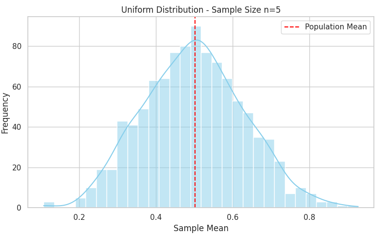

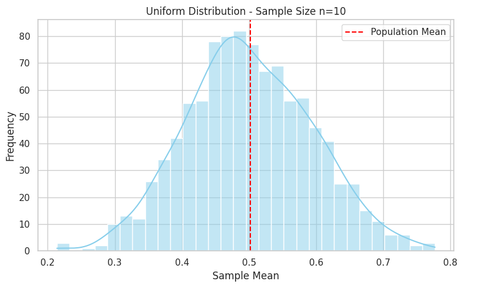

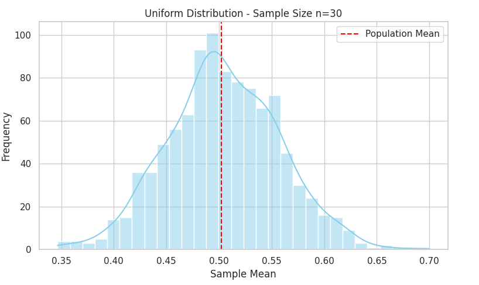

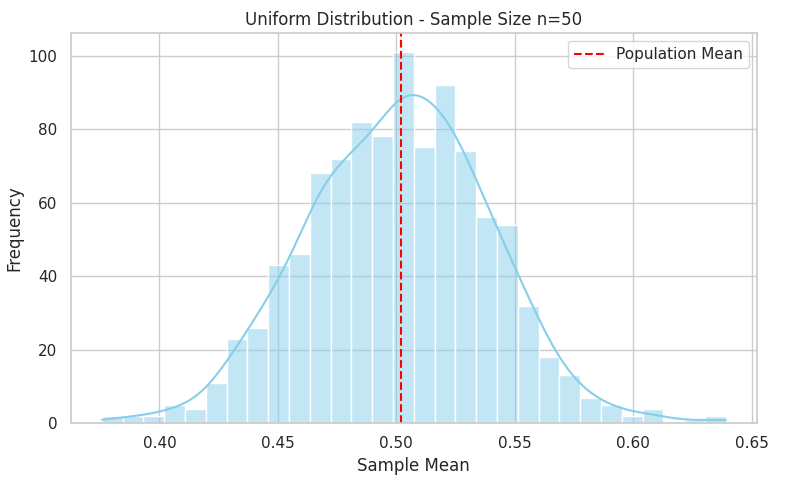

### Exponential

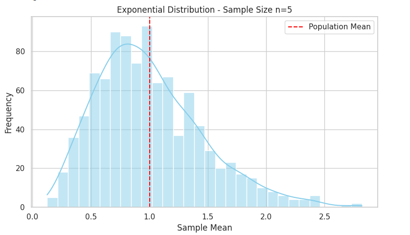

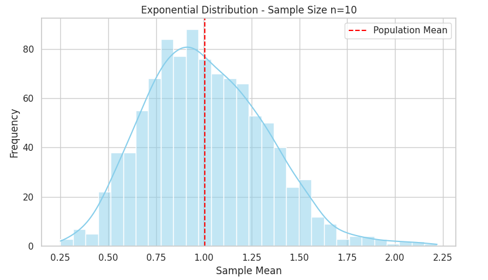

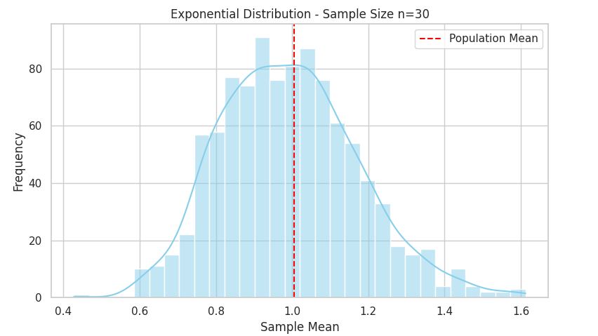

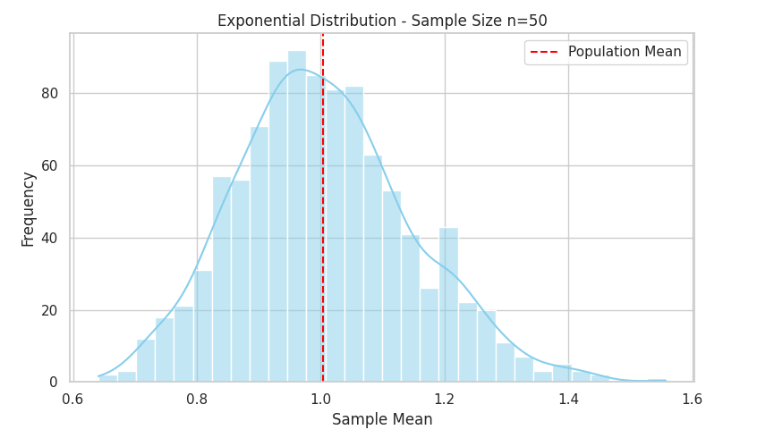

### Binomial

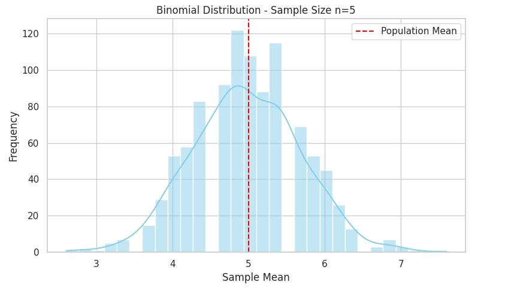

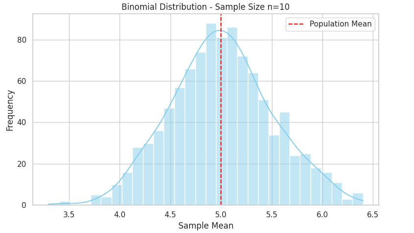

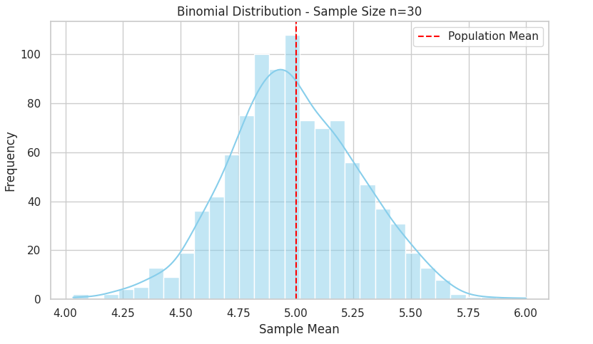

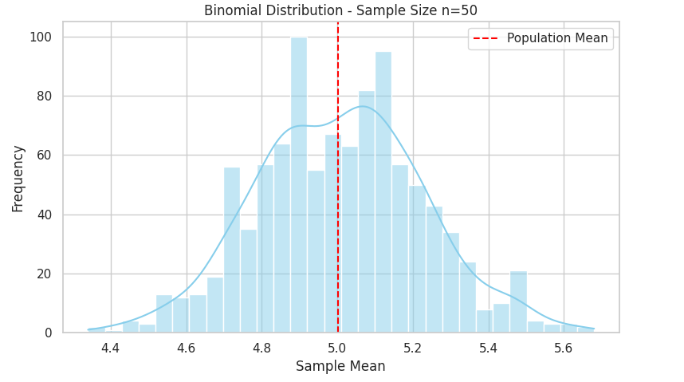

## Practical Applications

The Central Limit Theorem is not just a theoretical result; it has wide-reaching practical value across disciplines:

- **Statistical Inference**: Most confidence intervals and hypothesis tests are based on the assumption of normality in sample means. Thanks to the CLT, these tools remain reliable even when sampling from non-normal populations.
  
- **Quality Control**: In manufacturing, averages of product measurements are often tracked. The CLT justifies using control charts and standard thresholds based on normal distributions, even if the underlying measurement distributions are not normal.
  
- **Finance and Risk Management**: Portfolio returns over time are modeled using the normal distribution. The CLT provides the justification for aggregating returns and assuming a bell curve behavior in risk modeling.

- **Social Sciences and Biology**: Sample averages are foundational in survey analysis, clinical trials, and experiments where underlying variables often don’t follow normal distributions, but the means can be treated as such thanks to the CLT.

In short, the CLT underpins much of modern applied statistics and allows for robust inference from data in a wide range of contexts.

## Discussion

The simulations confirm the core intuition of the Central Limit Theorem: regardless of the original distribution — whether flat (uniform), discrete (binomial), or skewed (exponential) — the distribution of the sample mean tends toward normality as the sample size increases.

However, the rate and appearance of this convergence vary:
- Uniform distribution converged rapidly and showed a symmetric bell shape by $n = 30$.
- Binomial, already symmetric at the population level, showed early convergence but remained jagged due to its discrete nature.
- (Pending Exponential visuals) The exponential distribution, being heavily skewed, likely converges more slowly and retains some asymmetry even at larger $n$.

Additionally, the smoothness of the sampling distributions improves as $n$ increases, and the standard deviation of sample means becomes tighter — as predicted by the formula $\sigma / \sqrt{n}$.

These results reinforce both the power and the limits of the CLT: it works, but not instantly, and its appearance is shaped by the nature of the original data.

## Conclusion

Through simulation and visual analysis, this report has demonstrated the Central Limit Theorem in action. As sample sizes grow, the sampling distribution of the mean becomes increasingly normal, even when drawn from non-normal populations.

This empirical approach shows how the CLT serves as a bridge between the unpredictable nature of raw data and the structured, predictable behavior of sample averages. It is this principle that allows statisticians and scientists to draw valid conclusions from limited data in real-world scenarios.

While convergence depends on factors such as distribution shape, discreteness, and variance, the overall trend is unmistakable: large enough samples tend to behave normally — and this insight is foundational to the field of statistics.
