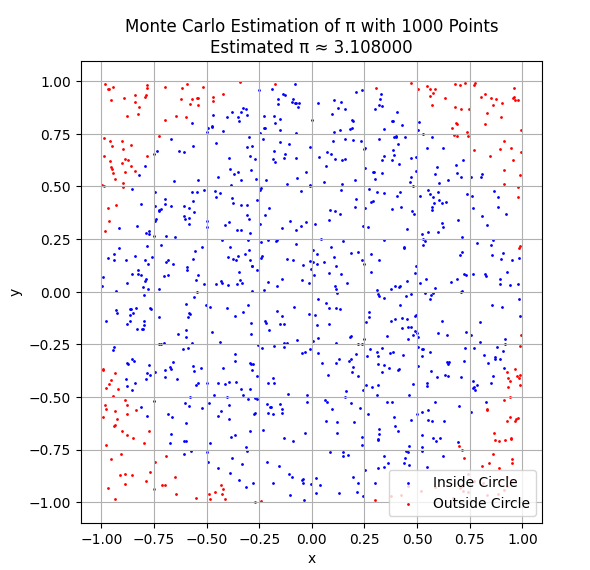
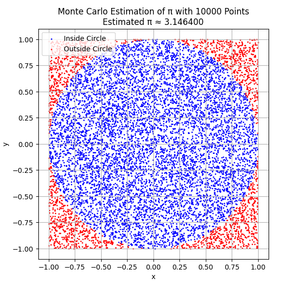
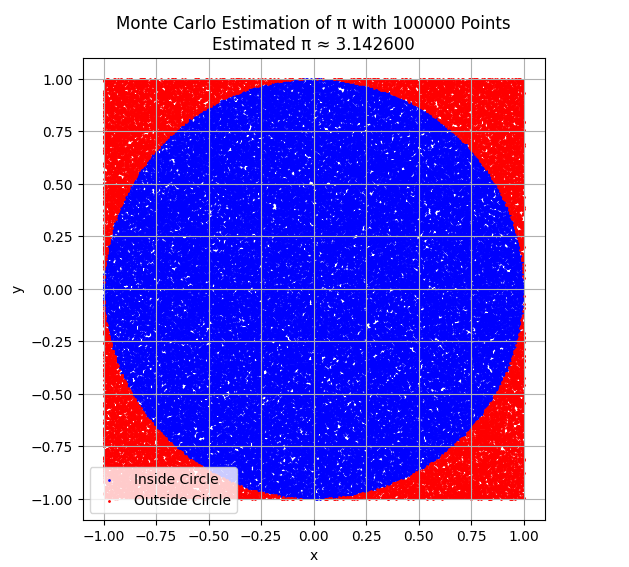
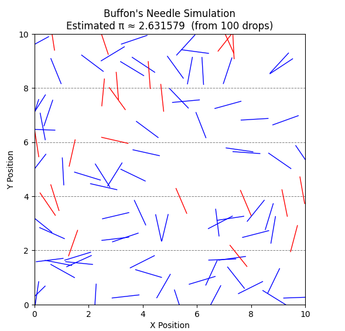
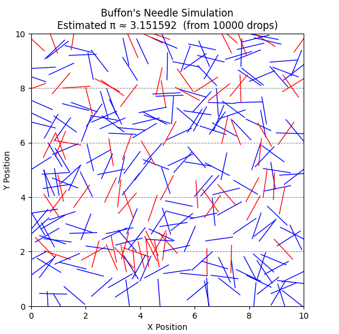
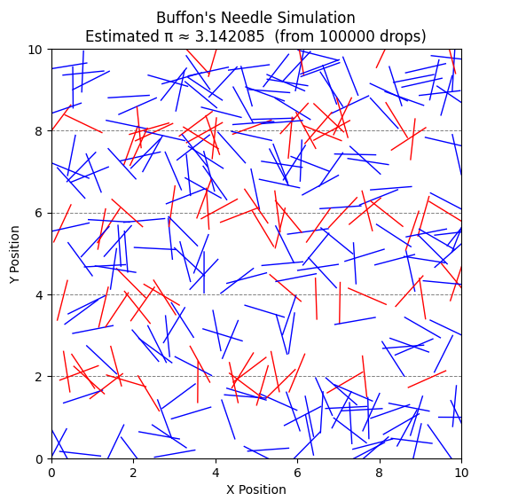

# Problem 2

# Estimating $\pi$ Using Monte Carlo Methods

*Part 1: Geometric Probability with a Circle*

## Introduction

Monte Carlo methods are a class of computational algorithms that rely on repeated random sampling to obtain numerical results. These techniques are widely used in fields such as physics, finance, and computer science to simulate systems with a high degree of complexity or randomness. One of the most elegant and accessible applications of Monte Carlo simulation is the estimation of the mathematical constant $\pi$ through geometric probability.

In this part of the report (Part 1), we focus on estimating $\pi$ by simulating random points within a square that bounds a unit circle. This method is visually intuitive, mathematically simple, and demonstrates how randomness can be used to solve problems in numerical analysis and statistical physics.

## Theoretical Foundation

Consider a square of side length 2 centered at the origin. Inscribed within this square is a circle of radius 1, also centered at the origin. The area of the square is:

$$
A_{\text{square}} = (2)^2 = 4
$$

The area of the circle is:

$$
A_{\text{circle}} = \pi r^2 = \pi \cdot 1^2 = \pi
$$

If we generate a large number of random points uniformly distributed within the square, the probability that a point falls inside the circle is equal to the ratio of the circle's area to the square's area:

$$
P = \frac{A_{\text{circle}}}{A_{\text{square}}} = \frac{\pi}{4}
$$

Solving for $\pi$, we get:

$$
\pi \approx 4 \cdot \frac{N_{\text{circle}}}{N_{\text{total}}}
$$

Where:

- $N_{\text{circle}}$ is the number of points that fall inside the circle,

- $N_{\text{total}}$ is the total number of points generated.

A point $(x, y)$ lies inside the circle if it satisfies the inequality:

$$
x^2 + y^2 \leq 1
$$

By simulating a large number of such points and applying the formula above, we can estimate the value of $\pi$. The larger the number of samples, the closer the estimate tends to be

## Simulation

You can try choosing the number of points yourself [here](https://colab.research.google.com/github/OlehVorobiov/Math-2024-25-Winter/blob/main/docs/Interactives/PiCircleEstimation.ipynb).

As seen in the plots above, the accuracy of the $\pi$ estimation improves as the number of randomly generated points increases. With only 1,000 points, the estimate fluctuates significantly, and the distribution appears uneven. At 10,000 points, the circle becomes more densely filled, and the estimation stabilizes. At 100,000 points, the estimate of $\pi$ closely approaches the actual value, and the visual difference between inside and outside points becomes much more refined.

The table below further supports this observation by listing 10 separate simulations for each point count. The averages clearly converge toward the true value of $\pi \approx 3.1416$ as the number of samples grows. This demonstrates the law of large numbers in action: increasing the number of trials reduces variance and yields more accurate results in probabilistic estimations.

### Table: Monte Carlo Estimations of $\pi$ with Varying Sample Sizes

| Measurement      | 1,000 Points | 10,000 Points | 100,000 Points |
|------------------|--------------|----------------|----------------|
|  1    | 3.080        | 3.1476         | 3.1350         |
|  2    | 3.120        | 3.1500         | 3.14676        |
|  3    | 3.108        | 3.1376         | 3.14264        |
|  4    | 3.132        | 3.1696         | 3.14280        |
|  5    | 3.092        | 3.1644         | 3.14624        |
|  6    | 3.104        | 3.1508         | 3.13724        |
|  7    | 3.176        | 3.1316         | 3.14308        |
|  8    | 3.032        | 3.1904         | 3.14808        |
|  9    | 3.108        | 3.1164         | 3.15408        |
|  10   | 3.012        | 3.1904         | 3.13824        |
| **Average**      | **3.0964**   | **3.15488**    | **3.143816**   |

## Conclusion

In this part of the report, we applied the Monte Carlo method to estimate the value of $\pi$ using a simple geometric probability model. By generating uniformly distributed random points within a square and measuring how many fell inside the inscribed unit circle, we derived an approximation for $\pi$ based on the ratio of areas.

Through visualizations and repeated simulations, we observed that the accuracy of the estimate improves significantly with the number of random samples. At low sample sizes, the estimates fluctuate noticeably, but as the number of points increases, the approximation stabilizes and converges toward the true value of $\pi$. This aligns with the law of large numbers and highlights a core strength of Monte Carlo methods: their simplicity and reliability when scaled.

Overall, this approach not only provides an intuitive demonstration of how randomness can be used to solve deterministic problems, but also introduces key statistical ideas such as convergence, variance, and computational trade-offs—foundational principles for more advanced simulations in physics and other scientific fields.

---

*Part 2: Buffon’s Needle Experiment*

## Introduction

In the 18th century, the French mathematician Georges-Louis Leclerc, Comte de Buffon, proposed one of the earliest known problems in geometric probability — now known as *Buffon’s Needle*. The question was simple: if a needle is dropped onto a floor marked with equally spaced parallel lines, what is the probability that it will cross one of the lines?

Surprisingly, this probability turns out to be related to the value of $\pi$. This makes Buffon’s Needle one of the oldest and most elegant probabilistic methods to estimate $\pi$, and it provides a fascinating example of how geometry, randomness, and probability intersect. In this part of the report, we explore this method both theoretically and computationally through Monte Carlo simulation.

## Theoretical Foundation

Imagine a floor with horizontal parallel lines spaced a distance $d$ apart. A needle of length $l$ is randomly dropped onto the floor. For the case where the needle length satisfies $l \leq d$, the probability that it crosses one of the lines is given by:

$$
P = \frac{2l}{\pi d}
$$

To understand this, consider two random variables:

- $x$: the perpendicular distance from the needle's center to the nearest line, uniformly distributed in $[0, \frac{d}{2}]$.

- $\theta$: the acute angle between the needle and the lines, uniformly distributed in $[0, \frac{\pi}{2}]$.

A crossing occurs if the vertical projection of the needle half-length exceeds the distance to the nearest line:

$$
\frac{l}{2} \sin(\theta) \geq x
$$

By integrating over the joint probability distribution of $x$ and $\theta$, the probability of a crossing yields the formula above. Rearranging this, we can estimate $\pi$ by observing the frequency of crossings in a simulation:

$$
\pi \approx \frac{2l \cdot N}{d \cdot C}
$$

Where:

- $N$ is the total number of needle drops,

- $C$ is the number of times the needle crosses a line.

This formula allows us to estimate $\pi$ empirically, using randomness and geometry. As with the circle-based method, accuracy improves with the number of trials, although convergence tends to be slower due to the geometric nature of the crossing condition.

## Simulation

To put the theory into practice, we simulate Buffon’s Needle experiment using different numbers of needle drops: 100, 10,000, and 100,000. Each drop involves generating a random angle and a random position, then checking whether the needle crosses one of the horizontal lines. This process allows us to estimate $\pi$ based on the proportion of crossings, as derived in the theoretical section.

You can try choosing the number of needle drops yourself [here](https://colab.research.google.com/github/OlehVorobiov/Math-2024-25-Winter/blob/main/docs/Interactives/PiBuffonNeedleEstimation.ipynb).

In the visualizations above, red needles indicate those that **cross** a line, while blue needles **do not**. This coloring provides a clear geometric interpretation of the condition used to determine whether a crossing occurs.

To avoid overloading the plot, we limit the visualization to a **maximum of around 300 needles** even if the total number of simulated drops is much higher. This makes the figure readable while still accurately representing the behavior of the method. The full sample size, however, is used for the numerical estimation of $\pi$, which is summarized in the table below.

| Measurement      | 100 Drops   | 10,000 Drops | 100,000 Drops |
|------------------|-------------|---------------|----------------|
| 1                | 3.030303    | 3.182686      | 3.137452       |
| 2                | 3.571429    | 3.125977      | 3.155769       |
| 3                | 3.225806    | 3.163556      | 3.143666       |
| 4                | 3.030303    | 3.151592      | 3.146633       |
| 5                | 3.225806    | 3.100775      | 3.145346       |
| 6                | 3.448276    | 3.216468      | 3.121488       |
| 7                | 2.631579    | 3.178640      | 3.118082       |
| 8                | 3.571429    | 3.153579      | 3.141592       |
| 9                | 2.631579    | 3.105590      | 3.155669       |
| 10               | 3.448276    | 3.241491      | 3.154475       |
| **Average**      | **3.181479**| **3.162035**  | **3.142017**   |

## Conclusion

Buffon’s Needle provides a fascinating historical and geometric approach to estimating $\pi$ using randomness. Through simulation, we observed how the proportion of needle crossings can be translated into an approximation of $\pi$ using a simple yet elegant probabilistic formula.

However, this method shows significant variance at low sample sizes, as demonstrated in the table. With only 100 drops, the estimates fluctuate dramatically. At 10,000 and 100,000 drops, the estimation stabilizes and begins to approach the true value of $\pi$, though not as tightly as the circle-based method.

While visually engaging and conceptually rich, Buffon’s Needle converges more slowly and is more sensitive to sample size, making it a good educational example but a less efficient estimator in practice.

---

## Final Comparison and Overall Conclusion

Both the circle-based and Buffon’s Needle Monte Carlo methods provide effective ways to estimate the value of $\pi$, but they differ in simplicity, efficiency, and convergence behavior.

### Accuracy and Convergence:
- The **circle method** produced estimates with relatively low variance, even at moderate sample sizes. Its average estimate with 100,000 points was **3.143816**, closely matching the known value of $\pi$.
- In contrast, **Buffon’s Needle** showed greater variability, especially at low drop counts. With 100,000 drops, it achieved a respectable average of **3.142017**, but required more samples to reach comparable stability.

### Computational Considerations:
- The circle method is computationally straightforward, requiring only basic distance checks in 2D space.
- Buffon’s method involves trigonometric functions and more nuanced geometric constraints, which adds a layer of complexity and slower convergence.

### Educational Value:
- Buffon’s Needle stands out for its historical importance and the way it links geometry, randomness, and probability in a tangible way.
- The circle method is more practical for teaching basic Monte Carlo estimation and convergence principles.

### Final Thoughts:
In conclusion, both simulations demonstrate how randomness can be used to solve deterministic mathematical problems. While the circle-based method is more efficient and precise for estimating $\pi$, Buffon’s Needle offers a unique and intellectually rich perspective that connects modern simulation with classical probability. Together, they highlight the versatility of Monte Carlo methods and their value in both computation and education.
