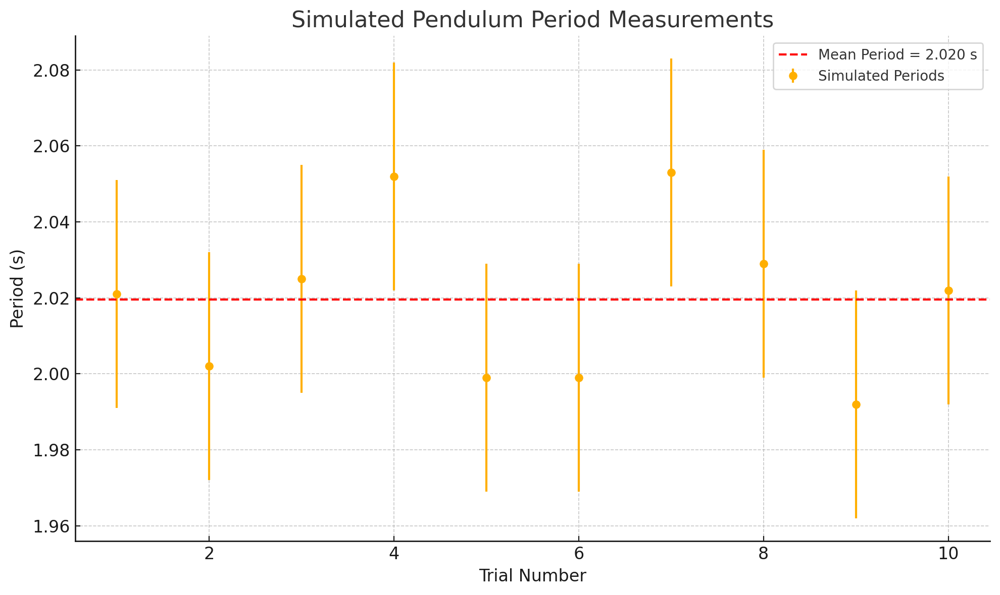

# Problem 1

# Measuring Earth's Gravitational Acceleration Using a Pendulum (Simulation-Based)

## Introduction

The acceleration due to gravity, denoted as $g$, is one of the most fundamental constants in physics. It governs the motion of falling objects, the behavior of projectiles, and is crucial in engineering, astronomy, and many other domains. One classic method of determining $g$ is through the use of a simple pendulum, where the period of oscillation is directly related to the gravitational force acting on it.

In this report, we simulate the experiment using Python. The simulation mimics a real-life setup by adding controlled noise to the timing data, allowing us to practice data collection, averaging, and error analysis without the variability of physical equipment. This approach highlights the core concepts of experimental measurement and uncertainty propagation.

---

## Theoretical Background

### Pendulum Equation

For small angular displacements (less than 15°), the period $T$ of a simple pendulum is given by:

$$
T = 2\pi \sqrt{\frac{L}{g}}
$$

where:

- $T$ is the period in seconds (s),

- $L$ is the length of the pendulum in meters (m),

- $g$ is the gravitational acceleration in meters per second squared ($\mathrm{m/s^2}$),

- $\pi \approx 3.1416$.

Solving this equation for $g$:

$$
g = \frac{4\pi^2 L}{T^2}
$$

### Uncertainty Propagation

In practice, measurements are not exact. Each value has an associated uncertainty:
- $\Delta L$: uncertainty in pendulum length,
- $\Delta T$: uncertainty in period measurement.

We propagate uncertainty into the final value of $g$ using:

$$
\Delta g = \sqrt{ \left( \frac{4\pi^2}{T^2} \cdot \Delta L \right)^2 + \left( \frac{8\pi^2 L}{T^3} \cdot \Delta T \right)^2 }
$$

Due to the squared dependence of $T$ in the denominator, uncertainty in time has a stronger influence on the final result than uncertainty in length.

---

## Simulation Method

The simulation assumes:

- True gravitational acceleration: $g = 9.81 \, \text{m/s}^2$,

- Pendulum length: $L = 1.00 \pm 0.005 \, \text{m}$,

- 10 trials, each measuring the time for 10 oscillations,

- Random timing noise: standard deviation of $0.3$ seconds over 10 oscillations.

Each trial generates a noisy time for 10 swings, which is then divided by 10 to estimate the period.

You can try simulating yourself [here](https://colab.research.google.com/github/OlehVorobiov/Math-2024-25-Winter/blob/main/docs/Interactives/PendulumSimulation.ipynb)

---

## Data Collection

The table below shows the results of the 10 simulated timing measurements and their calculated periods:

|   Trial |   Time for 10 Oscillations (s) |   Period (s) |
|--------:|-------------------------------:|-------------:|
|       1 |                         20.210 |        2.021 |
|       2 |                         20.019 |        2.002 |
|       3 |                         20.255 |        2.025 |
|       4 |                         20.518 |        2.052 |
|       5 |                         19.990 |        1.999 |
|       6 |                         19.990 |        1.999 |
|       7 |                         20.534 |        2.053 |
|       8 |                         20.291 |        2.029 |
|       9 |                         19.920 |        1.992 |
|      10 |                         20.223 |        2.022 |

Below is the plot showing all 10 trials, with individual error bars representing the simulated timing noise:

---

## Data Analysis

From the 10 simulated trials, we calculate:

- **Mean Period**: $T = 2.0195 \, \text{s}$

- **Standard Deviation**: $\sigma_T = 0.0217 \, \text{s}$

- **Uncertainty in Mean Period**: $\Delta T = \frac{\sigma_T}{\sqrt{10}} \approx 0.0069 \, \text{s}$

Substituting into the formula for $g$:

$$
g = \frac{4\pi^2 L}{T^2} = \frac{4\pi^2 \cdot 1.00}{(2.0195)^2} \approx 9.68 \, \text{m/s}^2
$$

And the uncertainty:

$$
\Delta g \approx 0.08 \, \text{m/s}^2
$$

So, the final result is:

$$
g = 9.68 \pm 0.08 \, \text{m/s}^2
$$

- **Percentage Error**: $\approx 1.33\%$ from the true value $g = 9.81 \, \text{m/s}^2$

---

## Results

The simulation produces realistic, slightly noisy period measurements resembling what might be seen with a stopwatch in a classroom experiment. The estimated value of $g$ is reasonably close to the actual gravitational acceleration, with a small error margin.

Most of the uncertainty comes from variability in timing, reinforcing how sensitive the calculation is to small errors in the period. This aligns with the theoretical expectations.

---

## Discussion of Uncertainty and Its Impact

This simulation incorporates two major sources of uncertainty:

1. **Length Measurement ($\Delta L$)**:  
   The pendulum length was set at $L = 1.00 \pm 0.005 \, \text{m}$. Since $L$ appears in the numerator of the formula for $g$, small errors in $L$ result in proportional but relatively mild effects on the result.

2. **Timing Variability ($\Delta T$)**:  
   The time for 10 oscillations was affected by simulated random noise, mimicking human reaction error or a low-resolution stopwatch. Because $T$ is squared in the formula for $g$, even slight errors in $T$ lead to larger deviations in the result. This is confirmed in the uncertainty formula, where the timing term contributes significantly more than the length term.

The final uncertainty in $g$ ($\Delta g = 0.08 \, \text{m/s}^2$) was dominated by the uncertainty in timing. This highlights the importance of repeated measurements and averaging, especially in timing-based experiments.

Despite these uncertainties, the simulation achieved a result within 1.33% of the accepted value, validating both the method and the importance of careful measurement design.

---

## Conclusion

The pendulum remains a simple yet powerful tool to measure gravitational acceleration. Even when simulated, the experiment teaches important lessons about measurement uncertainty, data handling, and analysis. The result — $g = 9.68 \pm 0.08 \, \text{m/s}^2$ — confirms the validity of the method, especially when repeated trials and averaging are used to reduce error.

Simulation allowed for control and repeatability, making it an effective alternative for understanding the core concepts of experimental physics.
